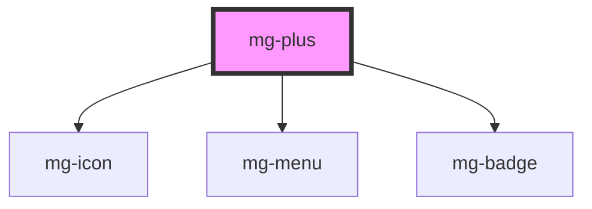

## Use

When not all of the items can be displayed because of the width of a [**`<mg-menu> horizontal`**](./?path=/docs/beta-menus-mg-menu--mg-menu) or **`<mg-menu>  mobile`** (TODO) or a [**`<mg-tabs>`**](./?path=/docs/molecules-mg-tabs--mg-tabs), items are replaced by a single "plus" item.

## Behavior

By clicking on the "plus" item a submenu displays the hidden items.

### With an horizontal menu or tabs

A **`<mg-menu>  vertical`** displays items in the style of the menu.

Submenu is aligned to the right of the item according to the "submenu of the [**`<mg-menu-item>`**](./?path=/docs/beta-menus-mg-menu-item--mg-menu-item) behavior.

### With a mobile menu

A **`<mg-menu> mobile`** displays, over the actual menu, items in the style of the menu.
There are as much lines of items as it is needed to display them.
The **`<mg-plus>`** item is replaced by a close button (flat with a cross).

### Badges

If one or more hidden items have **`<mg-badge>`**, the **`<mg-plus>`** item displays a badge with "exclamation" symbol as its content.

## Specs

### Anatomy

Use "ellipsis-vertical" [**`<mg-icon>`**](./?path=/story/atoms-mg-icon--mg-icon) for **`<mg-menu>  horizontal`** or **`<mg-tab>`**.
Use "ellipsis" [**`<mg-icon>`**](./?path=/story/atoms-mg-icon--mg-icon) for **`<mg-menu>  mobile`**.

<!-- Auto Generated Below -->

## Dependencies

### Depends on

- [mg-icon](../../components/atoms/mg-icon)
- [mg-menu](../../components/molecules/menu/mg-menu)
- [mg-badge](../../components/atoms/mg-badge)

### Graph

----------------------------------------------

*Built with [StencilJS](https://stenciljs.com/)*
