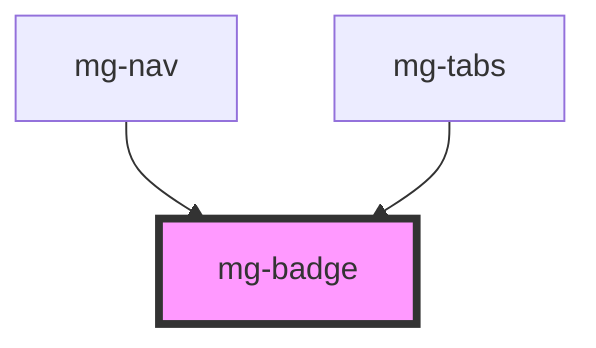

## Design

The badge is always placed on top of, or next to the element it is for.

The badge displays a number or a punctuation character.

## Specs

## Theming

<!-- Auto Generated Below -->

## Properties

| Property             | Attribute | Description                                                        | Type               | Default       |
| -------------------- | --------- | ------------------------------------------------------------------ | ------------------ | ------------- |
| `label` _(required)_ | `label`   | Badge label. Include short description. Required for accessibility | `string`           | `undefined`   |
| `outline`            | `outline` | Define if button is using outline style                            | `boolean`          | `undefined`   |
| `value` _(required)_ | `value`   | Badge value                                                        | `number \| string` | `undefined`   |
| `variant`            | `variant` | Define button variant                                              | `string`           | `variants[0]` |

## Dependencies

### Used by

 - [mg-nav](../../molecules/mg-nav)
 - [mg-tabs](../../molecules/mg-tabs)

### Graph

----------------------------------------------

*Built with [StencilJS](https://stenciljs.com/)*
