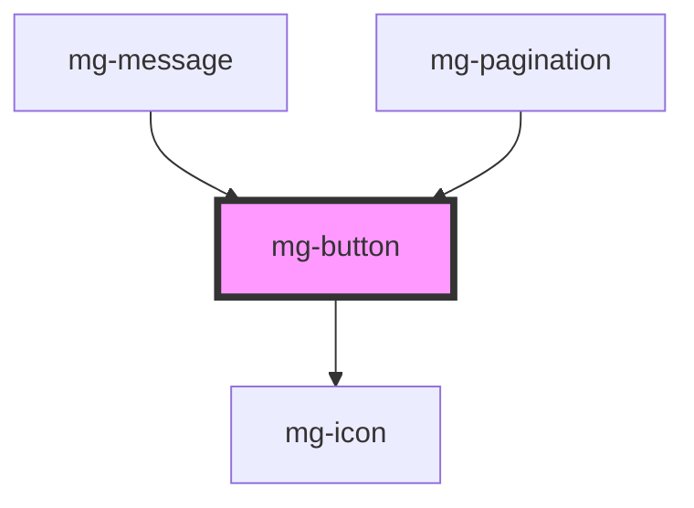

This atom refers to the [PDA9-67](https://jira.mgdis.fr/browse/PDA9-67).

<!-- Auto Generated Below -->

## Properties

| Property         | Attribute          | Description                                                                                                                                            | Type      | Default                 |
| ---------------- | ------------------ | ------------------------------------------------------------------------------------------------------------------------------------------------------ | --------- | ----------------------- |
| `disableOnClick` | `disable-on-click` | Option to set input disable on click, in order to prevent multi-click. Parent component have to remove the attribute 'disabled' when the process ends. | `boolean` | `false`                 |
| `disabled`       | `disabled`         | Disable button                                                                                                                                         | `boolean` | `false`                 |
| `identifier`     | `identifier`       | Identifier is used for the element ID (id is a reserved prop in Stencil.js) If not set, it will be created.                                            | `string`  | `createID('mg-button')` |
| `isIcon`         | `is-icon`          | Define if button is round. Used for icon button.                                                                                                       | `boolean` | `false`                 |
| `label`          | `label`            | aria-label In case button text is not explicit enough                                                                                                  | `string`  | `undefined`             |
| `variant`        | `variant`          | Define button variant                                                                                                                                  | `string`  | `variants[0]`           |

## Dependencies

### Used by

 - [mg-message](../../molecules/mg-message)
 - [mg-pagination](../../molecules/mg-pagination)

### Depends on

- [mg-icon](../mg-icon)

### Graph

----------------------------------------------

*Built with [StencilJS](https://stenciljs.com/)*
