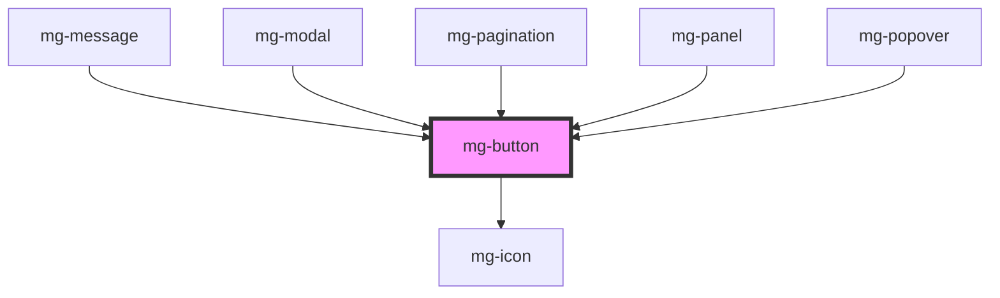

## Design

**RUX 01**: Un bouton d'action principale est majoritairement unique à l'écran, les autres boutons doivent être affichés en "secondaire", cela pour mettre en avant l'action principale.
Ex : Validation, Enregistrement

**RUX 02**: Un bouton d'action secondaire est représenté avec la dominante blanche
Ex : Annulation, Ajout dans une liste

**RUX 03**: Un bouton de traitement métier est représenté avec la dominante bleue
Ex : Lancement d'un traitement

**RUX 04**: L'icône précède le libellé du bouton, il n'est pas obligatoire.

**RUX 05**: Un bouton peut ne contenir qu'une icône (et pas de libellé), dans ce cas, si l'icone n'est pas assez explicite, une tooltip doit être affichée au survol et indiquer textuellement l'action du bouton.
 Ce cas ne concerne pas les boutons "communs" comme Valider, Annuler...etc.

**RUX 06**: Un bouton qui lance un traitement potentiellement long passe en mode disabled on click le temps du traitement.
Tant que le traitement n'est pas terminé, le bouton reste désactivé et un "loader" remplace le contenu.

**RUX 07**: Si plusieurs boutons sont placés les uns à côté des autres, ceux-ci sont séparés par une marge (10px).

### base

### main styles

### colors and states

### Display buttons side by side

<!-- Auto Generated Below -->

## Properties

| Property         | Attribute          | Description                                                                                                                                                              | Type                                                             | Default                 |
| ---------------- | ------------------ | ------------------------------------------------------------------------------------------------------------------------------------------------------------------------ | ---------------------------------------------------------------- | ----------------------- |
| `controls`       | `controls`         | Prop to set aria-controls on button element                                                                                                                              | `string`                                                         | `undefined`             |
| `disableOnClick` | `disable-on-click` | Option to set input disable on click, in order to prevent multi-click. Parent component have to remove the attribute 'disabled' when the process ends.                   | `boolean`                                                        | `false`                 |
| `disabled`       | `disabled`         | Disable button                                                                                                                                                           | `boolean`                                                        | `false`                 |
| `expanded`       | `expanded`         | Prop to set aria-expanded on button element                                                                                                                              | `boolean`                                                        | `false`                 |
| `haspopup`       | `haspopup`         | Option to set aria-haspopup The aria-haspopup state informs assistive technology users that there is a popup and the type of popup it is, but provides no interactivity. | `"dialog" \| "grid" \| "listbox" \| "menu" \| "tree" \| boolean` | `false`                 |
| `identifier`     | `identifier`       | Identifier is used for the element ID (id is a reserved prop in Stencil.js) If not set, it will be created.                                                              | `string`                                                         | `createID('mg-button')` |
| `isIcon`         | `is-icon`          | Define if button is round. Used for icon button.                                                                                                                         | `boolean`                                                        | `false`                 |
| `label`          | `label`            | aria-label In case button text is not explicit enough                                                                                                                    | `string`                                                         | `undefined`             |
| `variant`        | `variant`          | Define button variant                                                                                                                                                    | `string`                                                         | `variants[0]`           |

## Dependencies

### Used by

 - [mg-message](../../molecules/mg-message)
 - [mg-modal](../../molecules/mg-modal)
 - [mg-pagination](../../molecules/mg-pagination)
 - [mg-panel](../../molecules/mg-panel)
 - [mg-popover](../../molecules/mg-popover)

### Depends on

- [mg-icon](../mg-icon)

### Graph

----------------------------------------------

*Built with [StencilJS](https://stenciljs.com/)*
