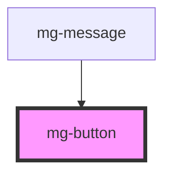

# mg-button

<!-- Auto Generated Below -->

## Properties

| Property     | Attribute    | Description                                                                                                                                                                                | Type      | Default                 |
| ------------ | ------------ | ------------------------------------------------------------------------------------------------------------------------------------------------------------------------------------------ | --------- | ----------------------- |
| `disabled`   | `disabled`   | Disable button                                                                                                                                                                             | `boolean` | `false`                 |
| `identifier` | `identifier` | Identifier is used for the element ID (id is a reserved prop in Stencil.js) If not set, it will be created.                                                                                | `string`  | `createID('mg-button')` |
| `isIcon`     | `is-icon`    | Define if button is round. Used for icon button.                                                                                                                                           | `boolean` | `false`                 |
| `label`      | `label`      | aria-label In case button text is not explicit enough                                                                                                                                      | `string`  | `undefined`             |
| `loading`    | `loading`    | Define if button is loading. Used to prevent double-click. Trigger when button is clicked or key-up 'enter', then value change to true. Must be set to false by parent at the process end. | `boolean` | `false`                 |
| `variant`    | `variant`    | Define button variant                                                                                                                                                                      | `string`  | `variants[0]`           |

## Dependencies

### Used by

 - [mg-message](../../molecules/mg-message)

### Graph

----------------------------------------------

*Built with [StencilJS](https://stenciljs.com/)*
