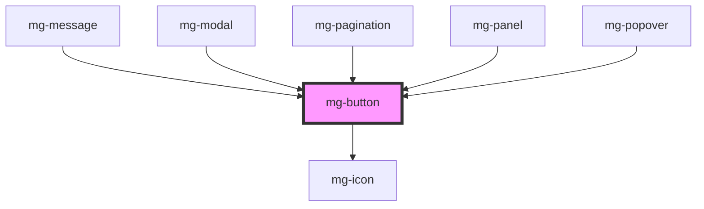

## Usage

A primary action button is, in most cases, unique on the screen, the other buttons must be displayed as "secondary", to highlight the primary action.
Ex: Validation, Save

A tooltip must be displayed on hover when the button only displays a non-explicit icon, and has no label. The tooltip must indicate the action of the button.

A button that launches a potentially long process is disabled and displays a loader for the duration of the process.

A button with undefined type in a form will natively have a [submit type](https://developer.mozilla.org/fr/docs/Web/HTML/Element/Button#attributs) and trigger form submission. So on non-submission buttons you need to explicitely set the type attribute as "button".

## Specs

## Placement

To manage the space between two buttons you can use the helper [.mg-group-elements](/?path=/docs/style-buttons--buttons)

## Theming

## CSS Variables

If needed some [variables](./?path=/story/css-variables--page) are available to customize the component:

### Global

- `--mg-button-border-radius`: define button border radius, default: `0.3rem`
- `--mg-button-icon-border-radius`: define button border radius in icon mode, default: `--default-size`
- `--mg-button-disabled-opacity`: define button opacity when disabled, default: `--mg-disabled-opacity`
- `--mg-button-gradient`: define if button use gradient, possible values 0 (no gradient) or 1 (with gradient), default: `1`
- `--mg-button-border-variation`: define if button has a border based on background color, possible values 0 (no border) or 1 (with border), default: `1`

### Variant

Variants `danger`, `danger-alt`, `info` and `success` can be customized by changing the global [colors](./?path=/docs/style-colors--page).

#### Primary

- `--mg-button-primary-color-h`: define hue color value for primary button, default: `--color-dark-h`
- `--mg-button-primary-color-s`: define saturation color value for primary button, default: `--color-dark-s`
- `--mg-button-primary-color-l`: define lightness color value for primary button, default: `--color-dark-l`
- `--mg-button-primary-font-color`: define font color for primary button, default: `--color-neutral`

#### Secondary

- `--mg-button-secondary-color-h`: define hue color value for secondary button, default: `--color-neutral-h`
- `--mg-button-secondary-color-s`: define saturation color value for secondary button, default: `--color-neutral-s`
- `--mg-button-secondary-color-l`: define lightness color value for secondary button, default: `--color-neutral-l`
- `--mg-button-secondary-font-color`: define font color for secondary button, default: `--color-dark`

<!-- Auto Generated Below -->

## Properties

| Property         | Attribute          | Description                                                                                                                                            | Type                                                                                              | Default       |
| ---------------- | ------------------ | ------------------------------------------------------------------------------------------------------------------------------------------------------ | ------------------------------------------------------------------------------------------------- | ------------- |
| `disableOnClick` | `disable-on-click` | Option to set input disable on click, in order to prevent multi-click. Parent component have to remove the attribute 'disabled' when the process ends. | `boolean`                                                                                         | `false`       |
| `disabled`       | `disabled`         | Disable button                                                                                                                                         | `boolean`                                                                                         | `undefined`   |
| `form`           | `form`             | Define form id to attach button with. If this attribute is not set, the <button> is associated with its ancestor <form> element.                       | `string`                                                                                          | `undefined`   |
| `fullWidth`      | `full-width`       | Set button to full-width                                                                                                                               | `boolean`                                                                                         | `false`       |
| `identifier`     | `identifier`       | Identifier is used for the element ID (id is a reserved prop in Stencil.js)                                                                            | `string`                                                                                          | `undefined`   |
| `isIcon`         | `is-icon`          | Define if button is round. Used for icon button.                                                                                                       | `boolean`                                                                                         | `false`       |
| `label`          | `label`            | aria-label In case button text is not explicit enough                                                                                                  | `string`                                                                                          | `undefined`   |
| `type`           | `type`             | Define button type                                                                                                                                     | `"button" \| "reset" \| "submit"`                                                                 | `undefined`   |
| `variant`        | `variant`          | Define button variant                                                                                                                                  | `"danger" \| "danger-alt" \| "flat" \| "info" \| "link" \| "primary" \| "secondary" \| "success"` | `variants[0]` |

## Dependencies

### Used by

 - [mg-message](../../molecules/mg-message)
 - [mg-modal](../../molecules/mg-modal)
 - [mg-pagination](../../molecules/mg-pagination)
 - [mg-panel](../../molecules/mg-panel)
 - [mg-popover](../../molecules/mg-popover)

### Depends on

- [mg-icon](../mg-icon)

### Graph

----------------------------------------------

*Built with [StencilJS](https://stenciljs.com/)*
