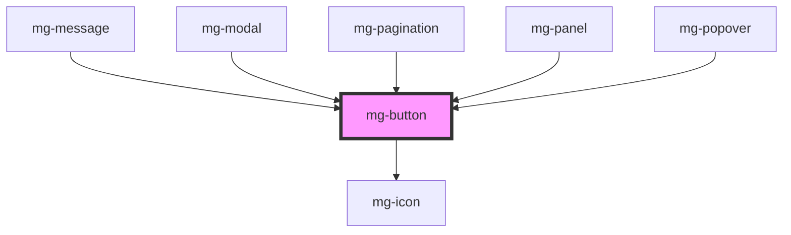

## Usage

A primary action button is mostly unique on the screen, the other buttons must be displayed as "secondary", to highlight the primary action.
Ex: Validation, Save

A tooltip must be displayed on hover when the button displays only a non-explicit icon without a label. The tooltip must indicate the action of the button.

A button that launches a potentially long process is disabled and displays a loader for the duration of the process.

## Specs

## Placement

## Theming

<!-- Auto Generated Below -->

## Properties

| Property         | Attribute          | Description                                                                                                                                                              | Type                                                             | Default                 |
| ---------------- | ------------------ | ------------------------------------------------------------------------------------------------------------------------------------------------------------------------ | ---------------------------------------------------------------- | ----------------------- |
| `controls`       | `controls`         | Prop to set aria-controls on button element                                                                                                                              | `string`                                                         | `undefined`             |
| `disableOnClick` | `disable-on-click` | Option to set input disable on click, in order to prevent multi-click. Parent component have to remove the attribute 'disabled' when the process ends.                   | `boolean`                                                        | `false`                 |
| `disabled`       | `disabled`         | Disable button                                                                                                                                                           | `boolean`                                                        | `false`                 |
| `expanded`       | `expanded`         | Prop to set aria-expanded on button element                                                                                                                              | `boolean`                                                        | `false`                 |
| `haspopup`       | `haspopup`         | Option to set aria-haspopup The aria-haspopup state informs assistive technology users that there is a popup and the type of popup it is, but provides no interactivity. | `"dialog" \| "grid" \| "listbox" \| "menu" \| "tree" \| boolean` | `false`                 |
| `identifier`     | `identifier`       | Identifier is used for the element ID (id is a reserved prop in Stencil.js) If not set, it will be created.                                                              | `string`                                                         | `createID('mg-button')` |
| `isIcon`         | `is-icon`          | Define if button is round. Used for icon button.                                                                                                                         | `boolean`                                                        | `false`                 |
| `label`          | `label`            | aria-label In case button text is not explicit enough                                                                                                                    | `string`                                                         | `undefined`             |
| `variant`        | `variant`          | Define button variant                                                                                                                                                    | `string`                                                         | `variants[0]`           |

## Dependencies

### Used by

 - [mg-message](../../molecules/mg-message)
 - [mg-modal](../../molecules/mg-modal)
 - [mg-pagination](../../molecules/mg-pagination)
 - [mg-panel](../../molecules/mg-panel)
 - [mg-popover](../../molecules/mg-popover)

### Depends on

- [mg-icon](../mg-icon)

### Graph

----------------------------------------------

*Built with [StencilJS](https://stenciljs.com/)*
