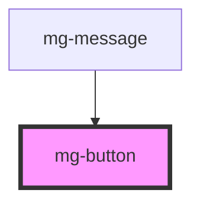

# mg-button

<!-- Auto Generated Below -->

## Properties

| Property   | Attribute  | Description                                           | Type      | Default       |
| ---------- | ---------- | ----------------------------------------------------- | --------- | ------------- |
| `disabled` | `disabled` | Disable button                                        | `boolean` | `false`       |
| `isIcon`   | `is-icon`  | Define if button is round. Used for icon button.      | `boolean` | `false`       |
| `label`    | `label`    | aria-label In case button text is not explicit enough | `string`  | `undefined`   |
| `variant`  | `variant`  | Define button variant                                 | `string`  | `variants[0]` |

## Dependencies

### Used by

 - [mg-message](../../molecules/mg-message)

### Graph

----------------------------------------------

*Built with [StencilJS](https://stenciljs.com/)*
