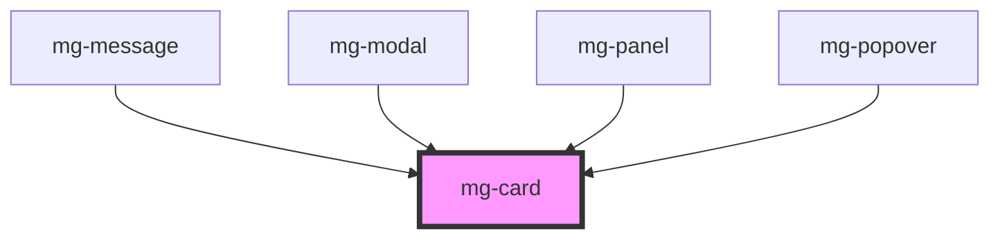

## Specs

### Style

1. Border radius: 5px
2. Background: [@color-light](./?path=/docs/style-colors--page)
3. Border: 1px, [@color-dark](./?path=/docs/style-colors--page) with alpha at 5%
4. Shadow: [@shadow](./?path=/docs/style-colors--page)

### Spacing

A padding of 16px is applied around the content

### Size

1. Ajusting with the content
2. Ajusting with its parent (100%)

## CSS Variables

If needed some [variables](./?path=/story/css-variables--page) are available to customize the component:

- `--mg-card-padding`: define car padding, default: `1.6rem`
- `--mg-card-border-radius`: define card border radius, default: `0.5rem`
- `--mg-card-background`: define card background, default: `hsl(var(--color-light))`
- `--mg-card-border`: define card border, default: `0.1rem solid hsla(var(--color-dark), 5%)`
- `--mg-card-box-shadow`: define card shadow, default: `var(--box-shadow)`
- `--mg-card-box-overflow`: define card overflow, default: `unset`

**If your component include child mg-card with different styles we recommand to use the target variable with '-override' suffix, ex: use `--mg-card-padding-overrride` instead of `--mg-card-padding`.**
Explenations: CSS variables is based on heritage behavior. So each child `var` value is updated by the value of its closer ancestor. When you use the variable with '-override' suffix, the librarie use the closest `--mg-card-padding` to re-assign `var` by its value for child. As a result, if you don't update directly the theme variable `--mg-card-padding` but the `--mg-card-padding-overrride`, your element default style will be the same as the template. 

<!-- Auto Generated Below -->

## Dependencies

### Used by

 - [mg-message](../../molecules/mg-message)
 - [mg-modal](../../molecules/mg-modal)
 - [mg-panel](../../molecules/mg-panel)
 - [mg-popover](../../molecules/mg-popover)

### Graph

----------------------------------------------

*Built with [StencilJS](https://stenciljs.com/)*
