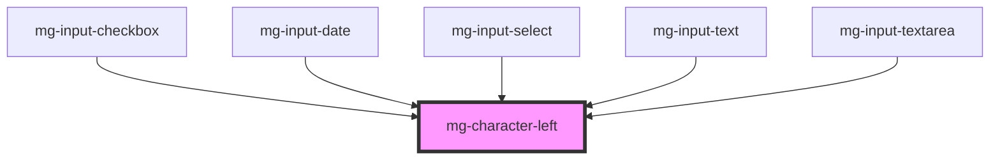

# mg-character-left

<!-- Auto Generated Below -->

## Properties

| Property                 | Attribute    | Description                                                                      | Type     | Default             |
| ------------------------ | ------------ | -------------------------------------------------------------------------------- | -------- | ------------------- |
| `characters`             | `characters` | Sets the characters to count                                                     | `string` | `''`                |
| `identifier`             | `identifier` | Sets an `id` attribute. Needed by the input for accessibility `arai-decribedby`. | `string` | `undefined`         |
| `maxlength` _(required)_ | `maxlength`  | Add maximum length                                                               | `number` | `undefined`         |
| `template`               | `template`   | Template to display remaining characters. Must have {counter} inside             | `string` | `locale.nbCharLeft` |

## Dependencies

### Used by

 - [mg-input-checkbox](../../molecules/inputs/mg-input-checkbox)
 - [mg-input-date](../../molecules/inputs/mg-input-date)
 - [mg-input-select](../../molecules/inputs/mg-input-select)
 - [mg-input-text](../../molecules/inputs/mg-input-text)
 - [mg-input-textarea](../../molecules/inputs/mg-input-textarea)

### Graph

----------------------------------------------

*Built with [StencilJS](https://stenciljs.com/)*
