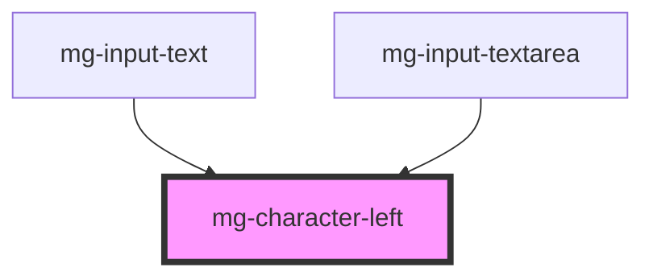

## Design

### Indication of the number of characters remaining

When the focus is on the input field, a message is displayed underneath. The message is: "`<nbCar>` characters available.", `<nbCar>` being a counter that updates dynamically according to the input.
When the focus is no longer on the input field, the message disappears.

<!-- Auto Generated Below -->

## Properties

| Property                 | Attribute    | Description                                                                      | Type     | Default     |
| ------------------------ | ------------ | -------------------------------------------------------------------------------- | -------- | ----------- |
| `characters`             | `characters` | Sets the characters to count                                                     | `string` | `''`        |
| `identifier`             | `identifier` | Sets an `id` attribute. Needed by the input for accessibility `aria-decribedby`. | `string` | `undefined` |
| `maxlength` _(required)_ | `maxlength`  | Add maximum length                                                               | `number` | `undefined` |

## Dependencies

### Used by

 - [mg-input-text](../../molecules/inputs/mg-input-text)
 - [mg-input-textarea](../../molecules/inputs/mg-input-textarea)

### Graph

----------------------------------------------

*Built with [StencilJS](https://stenciljs.com/)*
