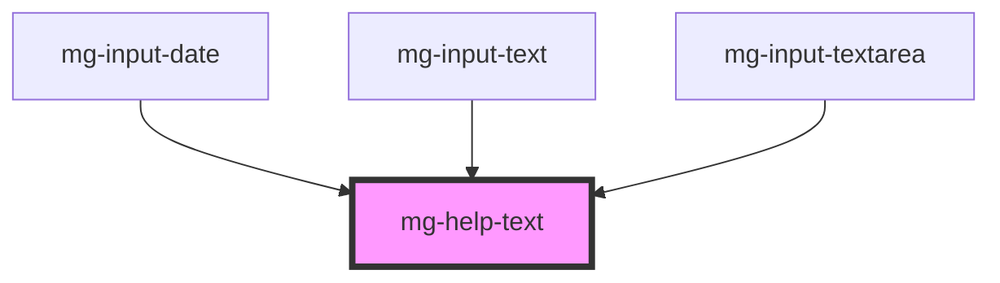

# mg-help-text

<!-- Auto Generated Below -->

## Properties

| Property     | Attribute    | Description                                                                    | Type     | Default     |
| ------------ | ------------ | ------------------------------------------------------------------------------ | -------- | ----------- |
| `identifier` | `identifier` | Sets an `id` element. Needed by the input for accessibility `arai-decribedby`. | `string` | `undefined` |

## Dependencies

### Used by

 - [mg-input-date](../../molecules/inputs/mg-input-date)
 - [mg-input-text](../../molecules/inputs/mg-input-text)
 - [mg-input-textarea](../../molecules/inputs/mg-input-textarea)

### Graph

----------------------------------------------

*Built with [StencilJS](https://stenciljs.com/)*
