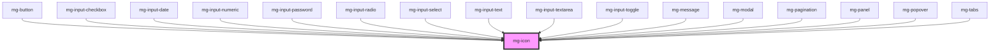

## Design

### Standard

Tailles (px) :

- 16x16 regular
- 24x24 large
- 36x36 extra-large

Couleur : du texte de la page (majoritairement @color-dark)

### Utilisation seul avec couleur informative

L'utilisation d'un picto seul portant une couleur informative doit afficher la couleur en fond pour des raisons d'accessibilité.

Les couleurs à utiliser sont des dérivées des couleurs standards, dont le luminosité est augmenté de 20%.

Règle ok pour toutes sauf le bleu de info, mais les pictos info seuls sont affichés dans la couleur de la police la plupart du temps.

### Nommage des fichiers

- Séparateur : "-" (tiret 6). De base les pictos sont la version "filled", mais pas besoin de le préciser dans le nommage
- Variante : "-outline". Si variante de picto avec un fond qui est un cercle plein > ajouter "-circle" ex : check-circle, check-circle-outline

<!-- Auto Generated Below -->

## Properties

| Property  | Attribute | Description                                                             | Type      | Default     |
| --------- | --------- | ----------------------------------------------------------------------- | --------- | ----------- |
| `icon`    | `icon`    | Icon to display                                                         | `string`  | `undefined` |
| `size`    | `size`    | Define icon size                                                        | `string`  | `'regular'` |
| `spin`    | `spin`    | Make the icon spin                                                      | `boolean` | `false`     |
| `variant` | `variant` | Define icon variant Add a background to the icon based on variant color | `string`  | `undefined` |

## Dependencies

### Used by

 - [mg-button](../mg-button)
 - [mg-input-checkbox](../../molecules/inputs/mg-input-checkbox)
 - [mg-input-date](../../molecules/inputs/mg-input-date)
 - [mg-input-numeric](../../molecules/inputs/mg-input-numeric)
 - [mg-input-password](../../molecules/inputs/mg-input-password)
 - [mg-input-radio](../../molecules/inputs/mg-input-radio)
 - [mg-input-select](../../molecules/inputs/mg-input-select)
 - [mg-input-text](../../molecules/inputs/mg-input-text)
 - [mg-input-textarea](../../molecules/inputs/mg-input-textarea)
 - [mg-input-toggle](../../molecules/inputs/mg-input-toggle)
 - [mg-message](../../molecules/mg-message)
 - [mg-modal](../../molecules/mg-modal)
 - [mg-pagination](../../molecules/mg-pagination)
 - [mg-panel](../../molecules/mg-panel)
 - [mg-popover](../../molecules/mg-popover)
 - [mg-tabs](../../molecules/mg-tabs)

### Graph

----------------------------------------------

*Built with [StencilJS](https://stenciljs.com/)*
