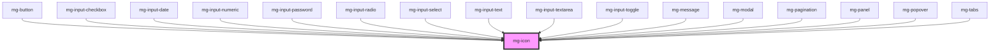

## Design

### Standard

Sizes (px) :

- 12x12 small
- 16x16 regular
- 24x24 large
- 36x36 extra-large

Color: text of the page (usually [@color-dark](?path=/docs/style-colors--page))

### Use alone with informative color

When using a pictograph alone with an informative color, the color must be displayed in the background for accessibility reasons.

The colors to be used are variations of the standard colors, with the brightness increased by 20%.

Rule applicable for all except "info" blue. "Info" pictographs without text are usually displayed in the font color.

### File naming

- Separator: "-" (dash). By default, the pictographs are the "filled" version, but this doesn't need to be specified in the naming
- Variant: "-outline". If pictograph variant has a background that has a full circle > add "-circle" ex : check-circle, check-circle-outline

<!-- Auto Generated Below -->

## Properties

| Property  | Attribute | Description                                                             | Type      | Default     |
| --------- | --------- | ----------------------------------------------------------------------- | --------- | ----------- |
| `icon`    | `icon`    | Icon to display                                                         | `string`  | `undefined` |
| `size`    | `size`    | Define icon size                                                        | `string`  | `'regular'` |
| `spin`    | `spin`    | Make the icon spin                                                      | `boolean` | `false`     |
| `variant` | `variant` | Define icon variant Add a background to the icon based on variant color | `string`  | `undefined` |

## Dependencies

### Used by

 - [mg-button](../mg-button)
 - [mg-input-checkbox](../../molecules/inputs/mg-input-checkbox)
 - [mg-input-date](../../molecules/inputs/mg-input-date)
 - [mg-input-numeric](../../molecules/inputs/mg-input-numeric)
 - [mg-input-password](../../molecules/inputs/mg-input-password)
 - [mg-input-radio](../../molecules/inputs/mg-input-radio)
 - [mg-input-select](../../molecules/inputs/mg-input-select)
 - [mg-input-text](../../molecules/inputs/mg-input-text)
 - [mg-input-textarea](../../molecules/inputs/mg-input-textarea)
 - [mg-input-toggle](../../molecules/inputs/mg-input-toggle)
 - [mg-message](../../molecules/mg-message)
 - [mg-modal](../../molecules/mg-modal)
 - [mg-pagination](../../molecules/mg-pagination)
 - [mg-panel](../../molecules/mg-panel)
 - [mg-popover](../../molecules/mg-popover)
 - [mg-tabs](../../molecules/mg-tabs)

### Graph

----------------------------------------------

*Built with [StencilJS](https://stenciljs.com/)*
