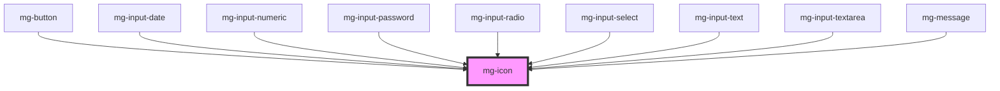

This atom refers to the [PDA9-744](https://jira.mgdis.fr/browse/PDA9-744).

<!-- Auto Generated Below -->

## Properties

| Property  | Attribute | Description                                                             | Type     | Default     |
| --------- | --------- | ----------------------------------------------------------------------- | -------- | ----------- |
| `icon`    | `icon`    | Icon to display                                                         | `string` | `undefined` |
| `size`    | `size`    | Define icon size                                                        | `string` | `"regular"` |
| `variant` | `variant` | Define icon variant Add a background to the icon based on variant color | `string` | `undefined` |

## Dependencies

### Used by

 - [mg-button](../mg-button)
 - [mg-input-date](../../molecules/inputs/mg-input-date)
 - [mg-input-numeric](../../molecules/inputs/mg-input-numeric)
 - [mg-input-password](../../molecules/inputs/mg-input-password)
 - [mg-input-radio](../../molecules/inputs/mg-input-radio)
 - [mg-input-select](../../molecules/inputs/mg-input-select)
 - [mg-input-text](../../molecules/inputs/mg-input-text)
 - [mg-input-textarea](../../molecules/inputs/mg-input-textarea)
 - [mg-message](../../molecules/mg-message)

### Graph

----------------------------------------------

*Built with [StencilJS](https://stenciljs.com/)*
