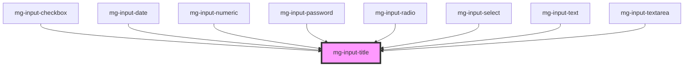

This atom refers to thes [PDA9-64](https://jira.mgdis.fr/browse/PDA9-64), [PDA9-723](https://jira.mgdis.fr/browse/PDA9-723).

<!-- Auto Generated Below -->

## Properties

| Property                  | Attribute    | Description                                                       | Type      | Default     |
| ------------------------- | ------------ | ----------------------------------------------------------------- | --------- | ----------- |
| `identifier` _(required)_ | `identifier` | Label input id                                                    | `string`  | `undefined` |
| `isLegend`                | `is-legend`  | Switch from label to fieldset sementic                            | `boolean` | `false`     |
| `required`                | `required`   | If input is required an asterisk is added at the end of the label | `boolean` | `undefined` |

## Dependencies

### Used by

 - [mg-input-checkbox](../../molecules/inputs/mg-input-checkbox)
 - [mg-input-date](../../molecules/inputs/mg-input-date)
 - [mg-input-numeric](../../molecules/inputs/mg-input-numeric)
 - [mg-input-password](../../molecules/inputs/mg-input-password)
 - [mg-input-radio](../../molecules/inputs/mg-input-radio)
 - [mg-input-select](../../molecules/inputs/mg-input-select)
 - [mg-input-text](../../molecules/inputs/mg-input-text)
 - [mg-input-textarea](../../molecules/inputs/mg-input-textarea)

### Graph

----------------------------------------------

*Built with [StencilJS](https://stenciljs.com/)*
