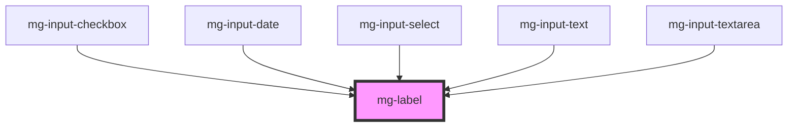

# mg-label

<!-- Auto Generated Below -->

## Properties

| Property     | Attribute    | Description                                                       | Type      | Default     |
| ------------ | ------------ | ----------------------------------------------------------------- | --------- | ----------- |
| `colon`      | `colon`      | Add a colon punctuation after label text                          | `boolean` | `undefined` |
| `identifier` | `identifier` | Label input id                                                    | `string`  | `undefined` |
| `required`   | `required`   | If input is required an asterisk is added at the end of the label | `boolean` | `undefined` |

## Dependencies

### Used by

 - [mg-input-checkbox](../../molecules/inputs/mg-input-checkbox)
 - [mg-input-date](../../molecules/inputs/mg-input-date)
 - [mg-input-select](../../molecules/inputs/mg-input-select)
 - [mg-input-text](../../molecules/inputs/mg-input-text)
 - [mg-input-textarea](../../molecules/inputs/mg-input-textarea)

### Graph

----------------------------------------------

*Built with [StencilJS](https://stenciljs.com/)*
