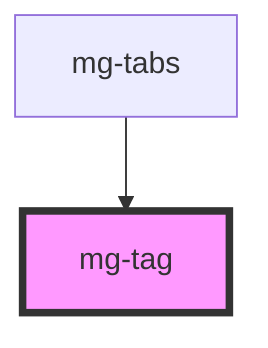

This atom refers to the [PDA9-637](https://jira.mgdis.fr/browse/PDA9-637).

<!-- Auto Generated Below -->

## Properties

| Property  | Attribute | Description                             | Type      | Default       |
| --------- | --------- | --------------------------------------- | --------- | ------------- |
| `outline` | `outline` | Define if button is using outline style | `boolean` | `undefined`   |
| `variant` | `variant` | Define button variant                   | `string`  | `variants[0]` |

## Dependencies

### Used by

 - [mg-tabs](../../molecules/mg-tabs)

### Graph

----------------------------------------------

*Built with [StencilJS](https://stenciljs.com/)*
