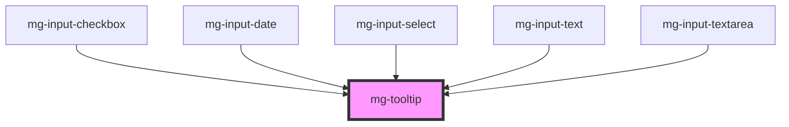

# mg-tooltip

<!-- Auto Generated Below -->

## Properties

| Property     | Attribute    | Description                                                                    | Type     | Default                  |
| ------------ | ------------ | ------------------------------------------------------------------------------ | -------- | ------------------------ |
| `identifier` | `identifier` | Sets an `id` element. Needed by the input for accessibility `arai-decribedby`. | `string` | `createID('mg-tooltip')` |
| `message`    | `message`    | Displayed message in the tooltip                                               | `string` | `undefined`              |

## Dependencies

### Used by

 - [mg-input-checkbox](../../molecules/inputs/mg-input-checkbox)
 - [mg-input-date](../../molecules/inputs/mg-input-date)
 - [mg-input-select](../../molecules/inputs/mg-input-select)
 - [mg-input-text](../../molecules/inputs/mg-input-text)
 - [mg-input-textarea](../../molecules/inputs/mg-input-textarea)

### Graph

----------------------------------------------

*Built with [StencilJS](https://stenciljs.com/)*
