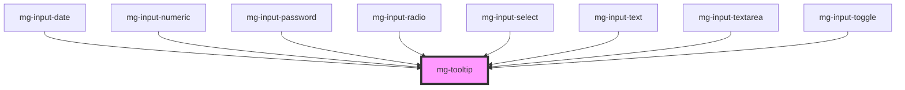

This atom refers to the [PDA9-313](https://jira.mgdis.fr/browse/PDA9-313).

<!-- Auto Generated Below -->

## Properties

| Property               | Attribute    | Description                                                                      | Type                                                                                                                                                                                                         | Default                  |
| ---------------------- | ------------ | -------------------------------------------------------------------------------- | ------------------------------------------------------------------------------------------------------------------------------------------------------------------------------------------------------------ | ------------------------ |
| `display`              | `display`    | Display tooltip                                                                  | `boolean`                                                                                                                                                                                                    | `false`                  |
| `identifier`           | `identifier` | Sets an `id` attribute. Needed by the input for accessibility `arai-decribedby`. | `string`                                                                                                                                                                                                     | `createID('mg-tooltip')` |
| `message` _(required)_ | `message`    | Displayed message in the tooltip                                                 | `string`                                                                                                                                                                                                     | `undefined`              |
| `placement`            | `placement`  | Tooltip placement                                                                | `"auto" \| "auto-end" \| "auto-start" \| "bottom" \| "bottom-end" \| "bottom-start" \| "left" \| "left-end" \| "left-start" \| "right" \| "right-end" \| "right-start" \| "top" \| "top-end" \| "top-start"` | `'bottom'`               |

## Dependencies

### Used by

 - [mg-input-date](../../molecules/inputs/mg-input-date)
 - [mg-input-numeric](../../molecules/inputs/mg-input-numeric)
 - [mg-input-password](../../molecules/inputs/mg-input-password)
 - [mg-input-radio](../../molecules/inputs/mg-input-radio)
 - [mg-input-select](../../molecules/inputs/mg-input-select)
 - [mg-input-text](../../molecules/inputs/mg-input-text)
 - [mg-input-textarea](../../molecules/inputs/mg-input-textarea)
 - [mg-input-toggle](../../molecules/inputs/mg-input-toggle)

### Graph

----------------------------------------------

*Built with [StencilJS](https://stenciljs.com/)*
