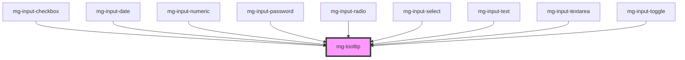

## Usage

Tooltips are messages that provide additional information about an element.
They are presented as a message that appears when an element is hovered over or when the keyboard is focused.
Tooltips are called "custom" when they are not built on the basis of the standard HTML code provided for these elements by the specification: the title attribute.
Our "custom tooltip" component is called "tooltip" here.

## Behavior

The tooltip must be displayed when the element that allows its display :

Is hovered over by the mouse.
Takes the keyboard focus.

The tooltip must be hidden when the element that allows its display :

Is no longer hovered over by the mouse.
Loses the keyboard focus.
Pressing the Escape key must hide the tooltip.

The tooltip must remain displayed when its content is hovered over by the mouse.

The tooltip can be placed above, to the right, below or to the left of the element it describes.

By default, the message is displayed at the bottom of the element.

If the element is located at the edge of the screen, the tooltip is shifted to be always visible.

## Specs

### Shapes

### Fonts

### Spacing

### Alignments

### Positioning

Triangle is always centered on the call component

### Colors

### Sizes

<!-- Auto Generated Below -->

## Properties

| Property               | Attribute    | Description                                                                      | Type                                                                                                                                                                                                         | Default                  |
| ---------------------- | ------------ | -------------------------------------------------------------------------------- | ------------------------------------------------------------------------------------------------------------------------------------------------------------------------------------------------------------ | ------------------------ |
| `disabled`             | `disabled`   | Disable tooltip                                                                  | `boolean`                                                                                                                                                                                                    | `false`                  |
| `display`              | `display`    | Display tooltip                                                                  | `boolean`                                                                                                                                                                                                    | `false`                  |
| `identifier`           | `identifier` | Sets an `id` attribute. Needed by the input for accessibility `aria-decribedby`. | `string`                                                                                                                                                                                                     | `createID('mg-tooltip')` |
| `message` _(required)_ | `message`    | Displayed message in the tooltip                                                 | `string`                                                                                                                                                                                                     | `undefined`              |
| `placement`            | `placement`  | Tooltip placement                                                                | `"auto" \| "auto-end" \| "auto-start" \| "bottom" \| "bottom-end" \| "bottom-start" \| "left" \| "left-end" \| "left-start" \| "right" \| "right-end" \| "right-start" \| "top" \| "top-end" \| "top-start"` | `'bottom'`               |

## Dependencies

### Used by

 - [mg-input-checkbox](../../molecules/inputs/mg-input-checkbox)
 - [mg-input-date](../../molecules/inputs/mg-input-date)
 - [mg-input-numeric](../../molecules/inputs/mg-input-numeric)
 - [mg-input-password](../../molecules/inputs/mg-input-password)
 - [mg-input-radio](../../molecules/inputs/mg-input-radio)
 - [mg-input-select](../../molecules/inputs/mg-input-select)
 - [mg-input-text](../../molecules/inputs/mg-input-text)
 - [mg-input-textarea](../../molecules/inputs/mg-input-textarea)
 - [mg-input-toggle](../../molecules/inputs/mg-input-toggle)

### Graph

----------------------------------------------

*Built with [StencilJS](https://stenciljs.com/)*
