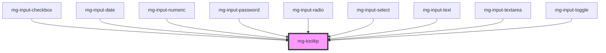

## Usage

Les infobulles sont des messages qui permettent d’obtenir une information complémentaire sur un élément.
Elles se présentent sous la forme d’un message qui apparaît au survol et à la prise de focus clavier d’un élément.
Les infobulles sont dites « personnalisées » lorsqu’elles ne sont pas construites sur la base du code HTML standard prévu pour ces éléments par la spécification : l’attribut title.
Notre composant "infobulle personnalisée" est appelé ici "tooltip"

## Behavior

La tooltip doit s’afficher lorsque l’élément qui en permet l’affichage :

Est survolé par la souris.
Prend le focus clavier.

La tooltip doit être masquée lorsque l’élément qui en permet l’affichage :

N’est plus survolé par la souris.
Perd le focus clavier.
Une pression de la touche Échap doit permettre de masquer l’infobulle.

L’infobulle doit rester affichée lorsque son contenu est survolé par la souris.

La tooltip peut être placée au dessus, à droite, en dessous, à gauche de l'élément qu'elle décrit.

Par défaut, le message s'affiche en bas de l'élément.

Si l'élément est situé au bord de l'écran, la tooltip se décale pour être toujours visible.

## Specs

### Formes

### Fonts

### Espacements

### Alignements

### Positionnement

Triangle is always centered on the call component

### Couleurs

### Tailles

<!-- Auto Generated Below -->

## Properties

| Property               | Attribute    | Description                                                                      | Type                                                                                                                                                                                                         | Default                  |
| ---------------------- | ------------ | -------------------------------------------------------------------------------- | ------------------------------------------------------------------------------------------------------------------------------------------------------------------------------------------------------------ | ------------------------ |
| `disabled`             | `disabled`   | Disable tooltip                                                                  | `boolean`                                                                                                                                                                                                    | `false`                  |
| `display`              | `display`    | Display tooltip                                                                  | `boolean`                                                                                                                                                                                                    | `false`                  |
| `identifier`           | `identifier` | Sets an `id` attribute. Needed by the input for accessibility `aria-decribedby`. | `string`                                                                                                                                                                                                     | `createID('mg-tooltip')` |
| `message` _(required)_ | `message`    | Displayed message in the tooltip                                                 | `string`                                                                                                                                                                                                     | `undefined`              |
| `placement`            | `placement`  | Tooltip placement                                                                | `"auto" \| "auto-end" \| "auto-start" \| "bottom" \| "bottom-end" \| "bottom-start" \| "left" \| "left-end" \| "left-start" \| "right" \| "right-end" \| "right-start" \| "top" \| "top-end" \| "top-start"` | `'bottom'`               |

## Dependencies

### Used by

 - [mg-input-checkbox](../../molecules/inputs/mg-input-checkbox)
 - [mg-input-date](../../molecules/inputs/mg-input-date)
 - [mg-input-numeric](../../molecules/inputs/mg-input-numeric)
 - [mg-input-password](../../molecules/inputs/mg-input-password)
 - [mg-input-radio](../../molecules/inputs/mg-input-radio)
 - [mg-input-select](../../molecules/inputs/mg-input-select)
 - [mg-input-text](../../molecules/inputs/mg-input-text)
 - [mg-input-textarea](../../molecules/inputs/mg-input-textarea)
 - [mg-input-toggle](../../molecules/inputs/mg-input-toggle)

### Graph

----------------------------------------------

*Built with [StencilJS](https://stenciljs.com/)*
