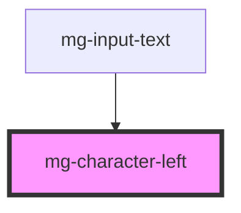

# mg-character-left

<!-- Auto Generated Below -->

## Properties

| Property                 | Attribute    | Description                                                                    | Type     | Default                               |
| ------------------------ | ------------ | ------------------------------------------------------------------------------ | -------- | ------------------------------------- |
| `characters`             | `characters` | Sets the characters to count                                                   | `string` | `''`                                  |
| `maxlength` _(required)_ | `maxlength`  | Add maximum length                                                             | `number` | `undefined`                           |
| `reference`              | `reference`  | Sets an `id` element. Needed by the input for accessibility `arai-decribedby`. | `string` | `undefined`                           |
| `template`               | `template`   | Template to display remaining characters. Must have {counter} inside           | `string` | `'{counter} caractères disponibles.'` |

## Dependencies

### Used by

 - [mg-input-text](../mg-input-text)

### Graph

----------------------------------------------

*Built with [StencilJS](https://stenciljs.com/)*
