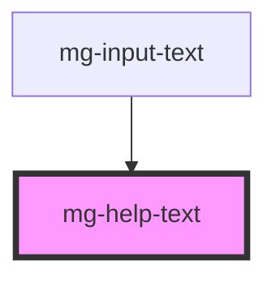

# mg-help-text

<!-- Auto Generated Below -->

## Properties

| Property    | Attribute   | Description                                                                    | Type     | Default     |
| ----------- | ----------- | ------------------------------------------------------------------------------ | -------- | ----------- |
| `reference` | `reference` | Sets an `id` element. Needed by the input for accessibility `arai-decribedby`. | `string` | `undefined` |

## Dependencies

### Used by

 - [mg-input-text](../mg-input-text)

### Graph

----------------------------------------------

*Built with [StencilJS](https://stenciljs.com/)*
