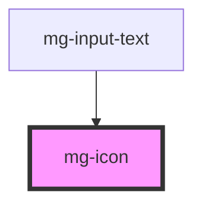

# mg-icon

<!-- Auto Generated Below -->

## Properties

| Property | Attribute | Description      | Type     | Default     |
| -------- | --------- | ---------------- | -------- | ----------- |
| `icon`   | `icon`    | Icon to display  | `string` | `undefined` |
| `size`   | `size`    | Define icon size | `string` | `"regular"` |

## Dependencies

### Used by

 - [mg-input-text](../mg-input-text)

### Graph

----------------------------------------------

*Built with [StencilJS](https://stenciljs.com/)*
