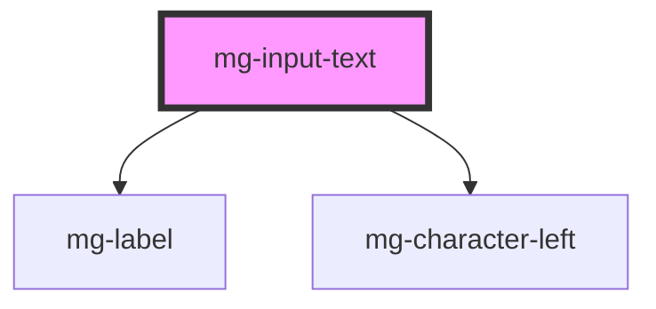

# mg-input-text

<!-- Auto Generated Below -->

## Properties

| Property                | Attribute                 | Description                                                                                                   | Type      | Default                     |
| ----------------------- | ------------------------- | ------------------------------------------------------------------------------------------------------------- | --------- | --------------------------- |
| `characterLeftTemplate` | `character-left-template` | Template to use for characters left sentence                                                                  | `string`  | `undefined`                 |
| `disabled`              | `disabled`                | Define if input is disabled                                                                                   | `boolean` | `undefined`                 |
| `displayCharacterLeft`  | `display-character-left`  | Define if component should display character left                                                             | `boolean` | `true`                      |
| `label` _(required)_    | `label`                   | Input label Required                                                                                          | `string`  | `undefined`                 |
| `maxlength`             | `maxlength`               | Input max length                                                                                              | `number`  | `400`                       |
| `name`                  | `name`                    | Input name If not set the value equals the reference                                                          | `string`  | `this.reference`            |
| `placeholder`           | `placeholder`             | Input placeholder                                                                                             | `string`  | `undefined`                 |
| `reference`             | `reference`               | Input reference used for the input ID (id is a reserved prop in Stencil.js) If not set, an ID will be created | `string`  | `createID('mg-input-text')` |
| `required`              | `required`                | Define if input is required                                                                                   | `boolean` | `undefined`                 |
| `value`                 | `value`                   | Component value                                                                                               | `string`  | `undefined`                 |

## Events

| Event     | Description                     | Type                  |
| --------- | ------------------------------- | --------------------- |
| `changed` | Emmited event when value change | `CustomEvent<string>` |

## Dependencies

### Depends on

- [mg-label](../mg-label)
- [mg-character-left](../mg-character-left)

### Graph

----------------------------------------------

*Built with [StencilJS](https://stenciljs.com/)*
