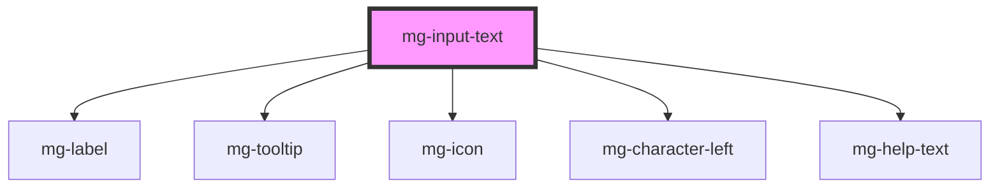

# mg-input-text

<!-- Auto Generated Below -->

## Properties

| Property                | Attribute                 | Description                                                                                                   | Type      | Default                       |
| ----------------------- | ------------------------- | ------------------------------------------------------------------------------------------------------------- | --------- | ----------------------------- |
| `characterLeftTemplate` | `character-left-template` | Template to use for characters left sentence                                                                  | `string`  | `undefined`                   |
| `disabled`              | `disabled`                | Define if input is disabled                                                                                   | `boolean` | `false`                       |
| `displayCharacterLeft`  | `display-character-left`  | Define if component should display character left                                                             | `boolean` | `true`                        |
| `helpText`              | `help-text`               | Template to use for characters left sentence                                                                  | `string`  | `undefined`                   |
| `identifier`            | `identifier`              | Input reference used for the input ID (id is a reserved prop in Stencil.js) If not set, an ID will be created | `string`  | `createID('mg-input-text')`   |
| `invalid`               | `invalid`                 | Define input pattern error message                                                                            | `boolean` | `undefined`                   |
| `label` _(required)_    | `label`                   | Input label Required                                                                                          | `string`  | `undefined`                   |
| `labelColon`            | `label-colon`             | Define if label has colon                                                                                     | `boolean` | `false`                       |
| `labelOnTop`            | `label-on-top`            | Define if label has colon                                                                                     | `boolean` | `undefined`                   |
| `maxlength`             | `maxlength`               | Input max length                                                                                              | `number`  | `this.multiline ? 4000 : 400` |
| `multiline`             | `multiline`               | Set the input text as multiline Switch to textarea if true                                                    | `boolean` | `false`                       |
| `name`                  | `name`                    | Input name If not set the value equals the reference                                                          | `string`  | `this.identifier`             |
| `pattern`               | `pattern`                 | Define input pattern to validate                                                                              | `string`  | `undefined`                   |
| `patternErrorMessage`   | `pattern-error-message`   | Define input pattern error message                                                                            | `string`  | `undefined`                   |
| `placeholder`           | `placeholder`             | Input placeholder                                                                                             | `string`  | `undefined`                   |
| `readonly`              | `readonly`                | Define if input is readonly                                                                                   | `boolean` | `false`                       |
| `required`              | `required`                | Define if input is required                                                                                   | `boolean` | `false`                       |
| `rows`                  | `rows`                    | Define textaera number of lines Only works with multiline activated                                           | `number`  | `3`                           |
| `tooltip`               | `tooltip`                 | Add a tooltip message next to the input                                                                       | `string`  | `undefined`                   |
| `valid`                 | `valid`                   | Define input pattern to validate                                                                              | `boolean` | `undefined`                   |
| `value`                 | `value`                   | Component value                                                                                               | `string`  | `undefined`                   |

## Events

| Event     | Description                     | Type                  |
| --------- | ------------------------------- | --------------------- |
| `changed` | Emmited event when value change | `CustomEvent<string>` |

## Methods

### `checkValidity() => Promise<boolean>`

Check input validity
TODO : I EXPOSED THIS METHOD, THE IDEA IS TO VALIDATE A FORM USING IT

#### Returns

Type: `Promise<boolean>`

## Dependencies

### Depends on

- [mg-label](../mg-label)
- [mg-tooltip](../mg-tooltip)
- [mg-icon](../mg-icon)
- [mg-character-left](../mg-character-left)
- [mg-help-text](../mg-help-text)

### Graph

----------------------------------------------

*Built with [StencilJS](https://stenciljs.com/)*
