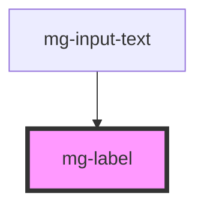

# mg-label

<!-- Auto Generated Below -->

## Properties

| Property    | Attribute   | Description                                                       | Type      | Default     |
| ----------- | ----------- | ----------------------------------------------------------------- | --------- | ----------- |
| `colon`     | `colon`     | Add a colon punctuation after label text                          | `boolean` | `undefined` |
| `reference` | `reference` | Label input reference To match for/id                             | `string`  | `undefined` |
| `required`  | `required`  | If input is required an asterisk is added at the end of the label | `boolean` | `undefined` |

## Dependencies

### Used by

 - [mg-input-text](../mg-input-text)

### Graph

----------------------------------------------

*Built with [StencilJS](https://stenciljs.com/)*
