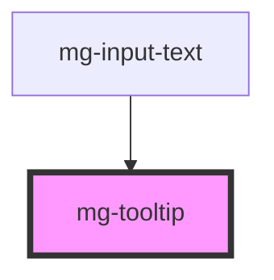

# mg-tooltip

<!-- Auto Generated Below -->

## Properties

| Property    | Attribute   | Description                                                                    | Type     | Default                  |
| ----------- | ----------- | ------------------------------------------------------------------------------ | -------- | ------------------------ |
| `message`   | `message`   | Displayed message in the tooltip                                               | `string` | `undefined`              |
| `reference` | `reference` | Sets an `id` element. Needed by the input for accessibility `arai-decribedby`. | `string` | `createID('mg-tooltip')` |

## Dependencies

### Used by

 - [mg-input-text](../mg-input-text)

### Graph

----------------------------------------------

*Built with [StencilJS](https://stenciljs.com/)*
