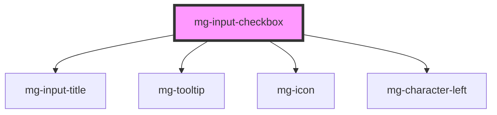

# mg-input-checkbox

<!-- Auto Generated Below -->

## Properties

| Property             | Attribute             | Description                                                                                                 | Type                           | Default                         |
| -------------------- | --------------------- | ----------------------------------------------------------------------------------------------------------- | ------------------------------ | ------------------------------- |
| `disabled`           | `disabled`            | Define if input is disabled                                                                                 | `boolean`                      | `false`                         |
| `helpText`           | `help-text`           | Template to use for characters left sentence                                                                | `string`                       | `undefined`                     |
| `identifier`         | `identifier`          | Identifier is used for the element ID (id is a reserved prop in Stencil.js) If not set, it will be created. | `string`                       | `createID('mg-input-checkbox')` |
| `inputVerticalList`  | `input-vertical-list` | Define if inputs are display verticaly                                                                      | `boolean`                      | `false`                         |
| `invalid`            | `invalid`             | Force invalid component                                                                                     | `boolean`                      | `undefined`                     |
| `items` _(required)_ | --                    | Items are the possible options to select Required                                                           | `CheckboxOption[] \| string[]` | `undefined`                     |
| `label` _(required)_ | `label`               | Input label Required                                                                                        | `string`                       | `undefined`                     |
| `labelColon`         | `label-colon`         | Define if label has colon ":"                                                                               | `boolean`                      | `false`                         |
| `labelHide`          | `label-hide`          | Define if label is visible                                                                                  | `boolean`                      | `false`                         |
| `labelOnTop`         | `label-on-top`        | Define if label is displayed on top                                                                         | `boolean`                      | `undefined`                     |
| `name`               | `name`                | Input name If not set the value equals the identifier                                                       | `string`                       | `this.identifier`               |
| `readonly`           | `readonly`            | Define if input is readonly                                                                                 | `boolean`                      | `false`                         |
| `required`           | `required`            | Define if input is required                                                                                 | `boolean`                      | `false`                         |
| `tooltip`            | `tooltip`             | Add a tooltip message next to the input                                                                     | `string`                       | `undefined`                     |
| `valid`              | `valid`               | Force valid component                                                                                       | `boolean`                      | `undefined`                     |
| `value`              | --                    | Component value If not set, checkbox will be indeterminate by default                                       | `CheckboxValue[]`              | `undefined`                     |

## Events

| Event         | Description                     | Type                           |
| ------------- | ------------------------------- | ------------------------------ |
| `valueChange` | Emitted event when value change | `CustomEvent<CheckboxValue[]>` |

## Dependencies

### Depends on

- [mg-input-title](../../../atoms/mg-input-title)
- [mg-tooltip](../../../atoms/mg-tooltip)
- [mg-icon](../../../atoms/mg-icon)
- [mg-character-left](../../../atoms/mg-character-left)

### Graph

----------------------------------------------

*Built with [StencilJS](https://stenciljs.com/)*
