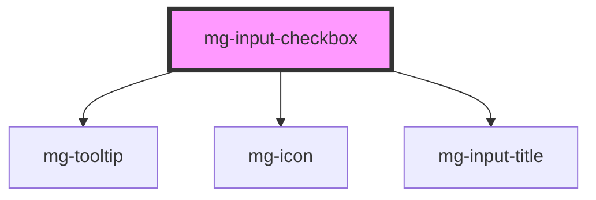

## Usage

True/False value notion.
Only 2 possible values.

### Theming

The style of the active checkbox is the browser's style.

## Specs

<!-- Auto Generated Below -->

## Properties

| Property             | Attribute             | Description                                                                                                 | Type              | Default                         |
| -------------------- | --------------------- | ----------------------------------------------------------------------------------------------------------- | ----------------- | ------------------------------- |
| `disabled`           | `disabled`            | Define if input is disabled                                                                                 | `boolean`         | `false`                         |
| `helpText`           | `help-text`           | Add a help text under the input, usually expected data format and example                                   | `string`          | `undefined`                     |
| `identifier`         | `identifier`          | Identifier is used for the element ID (id is a reserved prop in Stencil.js) If not set, it will be created. | `string`          | `createID('mg-input-checkbox')` |
| `inputVerticalList`  | `input-vertical-list` | Define if inputs are display verticaly                                                                      | `boolean`         | `false`                         |
| `invalid`            | `invalid`             | Define input invalid state                                                                                  | `boolean`         | `undefined`                     |
| `label` _(required)_ | `label`               | Input label                                                                                                 | `string`          | `undefined`                     |
| `labelHide`          | `label-hide`          | Define if label is visible                                                                                  | `boolean`         | `false`                         |
| `labelOnTop`         | `label-on-top`        | Define if label is displayed on top                                                                         | `boolean`         | `undefined`                     |
| `name`               | `name`                | Input name If not set the value equals the identifier                                                       | `string`          | `this.identifier`               |
| `readonly`           | `readonly`            | Define if input is readonly                                                                                 | `boolean`         | `false`                         |
| `required`           | `required`            | Define if input is required                                                                                 | `boolean`         | `false`                         |
| `tooltip`            | `tooltip`             | Add a tooltip message next to the input                                                                     | `string`          | `undefined`                     |
| `valid`              | `valid`               | Define input valid state                                                                                    | `boolean`         | `undefined`                     |
| `value` _(required)_ | --                    | Component value If item.value is `null`, checkbox will be indeterminate by default Required                 | `CheckboxValue[]` | `undefined`                     |

## Events

| Event          | Description                         | Type                           |
| -------------- | ----------------------------------- | ------------------------------ |
| `input-valid`  | Emited event when checking validity | `CustomEvent<boolean>`         |
| `value-change` | Emitted event when value change     | `CustomEvent<CheckboxValue[]>` |

## Methods

### `displayError() => Promise<void>`

Public method to display errors

#### Returns

Type: `Promise<void>`

## Dependencies

### Depends on

- [mg-tooltip](../../../atoms/mg-tooltip)
- [mg-icon](../../../atoms/mg-icon)
- [mg-input-title](../../../atoms/mg-input-title)

### Graph

----------------------------------------------

*Built with [StencilJS](https://stenciljs.com/)*
