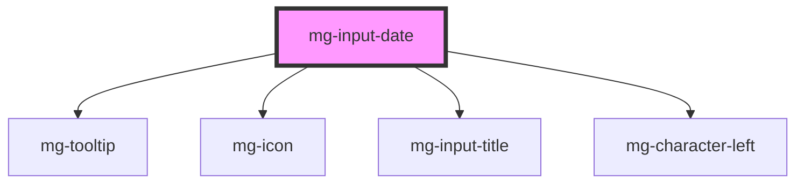

This atom refers to the [PDA9-65](https://jira.mgdis.fr/browse/PDA9-65).

<!-- Auto Generated Below -->

## Properties

| Property             | Attribute      | Description                                                                                                 | Type      | Default                     |
| -------------------- | -------------- | ----------------------------------------------------------------------------------------------------------- | --------- | --------------------------- |
| `disabled`           | `disabled`     | Define if input is disabled                                                                                 | `boolean` | `false`                     |
| `helpText`           | `help-text`    | Add a help text under the input, usually expected data format and example                                   | `string`  | `undefined`                 |
| `identifier`         | `identifier`   | Identifier is used for the element ID (id is a reserved prop in Stencil.js) If not set, it will be created. | `string`  | `createID('mg-input-date')` |
| `invalid`            | `invalid`      | Define input pattern error message                                                                          | `boolean` | `undefined`                 |
| `label` _(required)_ | `label`        | Input label Required                                                                                        | `string`  | `undefined`                 |
| `labelHide`          | `label-hide`   | Define if label is visible                                                                                  | `boolean` | `false`                     |
| `labelOnTop`         | `label-on-top` | Define if label is displayed on top                                                                         | `boolean` | `undefined`                 |
| `max`                | `max`          | Define input maximum date format: yyyy-mm-dd                                                                | `string`  | `undefined`                 |
| `min`                | `min`          | Define input minimum date format: yyyy-mm-dd                                                                | `string`  | `undefined`                 |
| `name`               | `name`         | Input name If not set the value equals the identifier                                                       | `string`  | `this.identifier`           |
| `readonly`           | `readonly`     | Define if input is readonly                                                                                 | `boolean` | `false`                     |
| `required`           | `required`     | Define if input is required                                                                                 | `boolean` | `false`                     |
| `tooltip`            | `tooltip`      | Add a tooltip message next to the input                                                                     | `string`  | `undefined`                 |
| `valid`              | `valid`        | Define input pattern to validate                                                                            | `boolean` | `undefined`                 |
| `value`              | `value`        | Component value                                                                                             | `string`  | `undefined`                 |

## Events

| Event          | Description                     | Type                  |
| -------------- | ------------------------------- | --------------------- |
| `value-change` | Emmited event when value change | `CustomEvent<string>` |

## Dependencies

### Depends on

- [mg-tooltip](../../../atoms/mg-tooltip)
- [mg-icon](../../../atoms/mg-icon)
- [mg-input-title](../../../atoms/mg-input-title)
- [mg-character-left](../../../atoms/mg-character-left)

### Graph

----------------------------------------------

*Built with [StencilJS](https://stenciljs.com/)*
