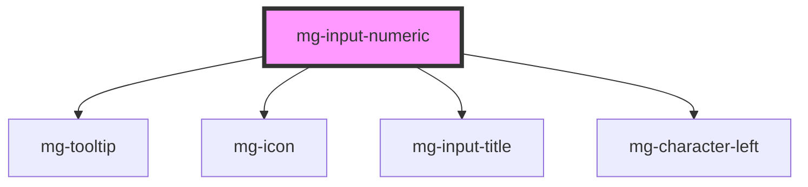

## Design

**RG-01** : Un champ montant est un champ numérique. Par défaut il est limité à 16 caractères (virgule comprise).

**RG-02** : Il n'est pas possible de saisir des caractères autre que des chiffres, "," ou "."

**RG-03** : L'arrondi se fait à deux chiffres après la virgule.

**RG-04** : Il est impossible de saisir plus de deux chiffres après la virgule.

**RG-05** : Il est possible de préciser une unité à la suite du champ pour les entiers et les décimaux. Pour les monétaires, le symbole de la devise est positionné dans la zone de saisie, à la suite de la valeur.

TODO ajouter les règles pour les valeurs min & max

### Placements

### Positionnement de l'unité

A gérer via la mise en place du composant en utilisant un caractère "espace" avant le terme de l'unité

## 🚨 Slot

Horizontal spacing is not managed by the component, it must be defined in slot implementation.

<!-- Auto Generated Below -->

## Properties

| Property             | Attribute        | Description                                                                                                                                    | Type                     | Default                        |
| -------------------- | ---------------- | ---------------------------------------------------------------------------------------------------------------------------------------------- | ------------------------ | ------------------------------ |
| `decimalLength`      | `decimal-length` | Override decimal length decimal is the number after the decimal point                                                                          | `number`                 | `2`                            |
| `disabled`           | `disabled`       | Define if input is disabled                                                                                                                    | `boolean`                | `false`                        |
| `helpText`           | `help-text`      | Add a help text under the input, usually expected data format and example                                                                      | `string`                 | `undefined`                    |
| `identifier`         | `identifier`     | Identifier is used for the element ID (id is a reserved prop in Stencil.js) If not set, it will be created.                                    | `string`                 | `createID('mg-input-numeric')` |
| `integerLength`      | `integer-length` | Override integer length integer is the number before the decimal point                                                                         | `number`                 | `13`                           |
| `invalid`            | `invalid`        | Define input pattern error message                                                                                                             | `boolean`                | `undefined`                    |
| `label` _(required)_ | `label`          | Input label                                                                                                                                    | `string`                 | `undefined`                    |
| `labelHide`          | `label-hide`     | Define if label is visible                                                                                                                     | `boolean`                | `false`                        |
| `labelOnTop`         | `label-on-top`   | Define if label is displayed on top                                                                                                            | `boolean`                | `undefined`                    |
| `max`                | `max`            | Maximum value                                                                                                                                  | `number`                 | `undefined`                    |
| `min`                | `min`            | Minimum value                                                                                                                                  | `number`                 | `undefined`                    |
| `name`               | `name`           | Input name If not set the value equals the identifier                                                                                          | `string`                 | `this.identifier`              |
| `placeholder`        | `placeholder`    | Input placeholder. It should be a word or short phrase that demonstrates the expected type of data, not a replacement for labels or help text. | `string`                 | `undefined`                    |
| `readonly`           | `readonly`       | Define if input is readonly                                                                                                                    | `boolean`                | `false`                        |
| `required`           | `required`       | Define if input is required                                                                                                                    | `boolean`                | `false`                        |
| `tooltip`            | `tooltip`        | Add a tooltip message next to the input                                                                                                        | `string`                 | `undefined`                    |
| `type`               | `type`           | Define numeric type                                                                                                                            | `string`                 | `types[0]`                     |
| `valid`              | `valid`          | Define input pattern to validate                                                                                                               | `boolean`                | `undefined`                    |
| `value`              | `value`          | Component value                                                                                                                                | `string`                 | `undefined`                    |
| `width`              | `width`          | Define input width                                                                                                                             | `"full" \| 16 \| 2 \| 4` | `undefined`                    |

## Events

| Event          | Description                         | Type                   |
| -------------- | ----------------------------------- | ---------------------- |
| `input-valid`  | Emited event when checking validity | `CustomEvent<boolean>` |
| `value-change` | Emited event when value change      | `CustomEvent<number>`  |

## Methods

### `displayError() => Promise<void>`

Public method to display errors

#### Returns

Type: `Promise<void>`

## Dependencies

### Depends on

- [mg-tooltip](../../../atoms/mg-tooltip)
- [mg-icon](../../../atoms/mg-icon)
- [mg-input-title](../../../atoms/mg-input-title)
- [mg-character-left](../../../atoms/mg-character-left)

### Graph

----------------------------------------------

*Built with [StencilJS](https://stenciljs.com/)*
