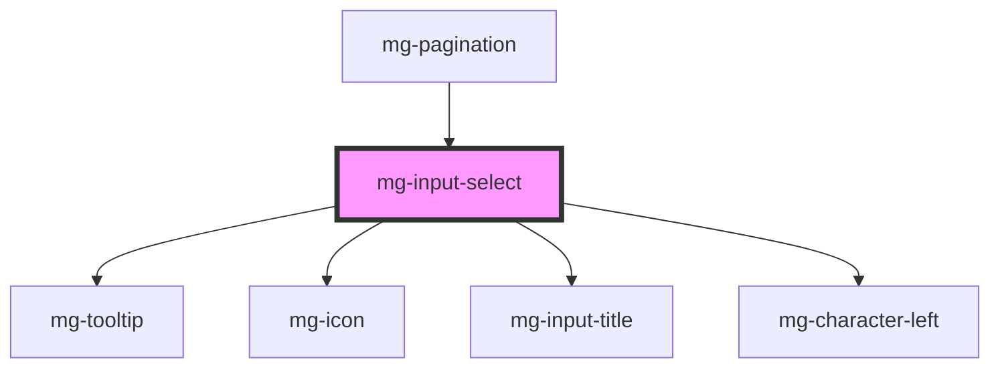

## Design

The behavior is the native one of the browser

The placeholder of the list is "Select a value".

The style and position of the chevron on the right of the field are those of the native browser.
The spacing between the text and the chevron is at least 10px.

<!-- Auto Generated Below -->

## Properties

| Property              | Attribute              | Description                                                                                                                                    | Type                         | Default                             |
| --------------------- | ---------------------- | ---------------------------------------------------------------------------------------------------------------------------------------------- | ---------------------------- | ----------------------------------- |
| `disabled`            | `disabled`             | Define if input is disabled                                                                                                                    | `boolean`                    | `false`                             |
| `helpText`            | `help-text`            | Add a help text under the input, usually expected data format and example                                                                      | `string`                     | `undefined`                         |
| `identifier`          | `identifier`           | Identifier is used for the element ID (id is a reserved prop in Stencil.js) If not set, it will be created.                                    | `string`                     | `createID('mg-input-select')`       |
| `invalid`             | `invalid`              | Define input invalid state                                                                                                                     | `boolean`                    | `undefined`                         |
| `items` _(required)_  | --                     | Items are the possible options to select                                                                                                       | `SelectOption[] \| string[]` | `undefined`                         |
| `label` _(required)_  | `label`                | Input label                                                                                                                                    | `string`                     | `undefined`                         |
| `labelHide`           | `label-hide`           | Define if label is visible                                                                                                                     | `boolean`                    | `false`                             |
| `labelOnTop`          | `label-on-top`         | Define if label is displayed on top                                                                                                            | `boolean`                    | `undefined`                         |
| `name`                | `name`                 | Input name If not set the value equals the identifier                                                                                          | `string`                     | `this.identifier`                   |
| `placeholder`         | `placeholder`          | Input placeholder. It should be a word or short phrase that demonstrates the expected type of data, not a replacement for labels or help text. | `string`                     | `messages.input.select.placeholder` |
| `placeholderDisabled` | `placeholder-disabled` | Option to disable placeholder                                                                                                                  | `boolean`                    | `false`                             |
| `placeholderHide`     | `placeholder-hide`     | Option to remove placeholder                                                                                                                   | `boolean`                    | `false`                             |
| `readonly`            | `readonly`             | Define if input is readonly                                                                                                                    | `boolean`                    | `false`                             |
| `required`            | `required`             | Define if input is required                                                                                                                    | `boolean`                    | `false`                             |
| `tooltip`             | `tooltip`              | Add a tooltip message next to the input                                                                                                        | `string`                     | `undefined`                         |
| `valid`               | `valid`                | Define input valid state                                                                                                                       | `boolean`                    | `undefined`                         |
| `value`               | `value`                | Component value                                                                                                                                | `any`                        | `undefined`                         |
| `width`               | `width`                | Define input width                                                                                                                             | `"full" \| 16 \| 2 \| 4`     | `undefined`                         |

## Events

| Event          | Description                         | Type                   |
| -------------- | ----------------------------------- | ---------------------- |
| `input-valid`  | Emited event when checking validity | `CustomEvent<boolean>` |
| `value-change` | Emited event when value change      | `CustomEvent<any>`     |

## Methods

### `displayError() => Promise<void>`

Public method to display errors

#### Returns

Type: `Promise<void>`

## Dependencies

### Used by

 - [mg-pagination](../../mg-pagination)

### Depends on

- [mg-tooltip](../../../atoms/mg-tooltip)
- [mg-icon](../../../atoms/mg-icon)
- [mg-input-title](../../../atoms/mg-input-title)
- [mg-character-left](../../../atoms/mg-character-left)

### Graph

----------------------------------------------

*Built with [StencilJS](https://stenciljs.com/)*
