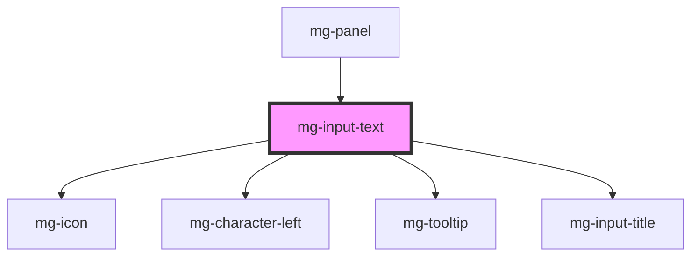

## Design

### Indication of the number of characters left

- when the focus is on the input field, the `mg-character-left` component is displayed
- when the focus is no longer on the input field, the message disappears
- by default limited to 400 alpha numeric characters

#### Font

Open Sans, regular, 11px  
Color: [@color-dark](./?path=/docs/style-colors--page), opacity : 0.6

#### Spacing

#### Position

Position : center

## Use as search input

Due to [accessibility recommendation](https://developer.mozilla.org/en-US/docs/Web/HTML/Element/Input/search#search_form_labels_and_accessibility), an `<input type="search" />` must be used within a `<form role="search" />` we recommend using mg-input-text as in dedicated story.

The "search" role can only be used when the input field is the main website search field. 

## Slot

The spacing between the field and the slot content is not managed by the component, it must be defined in slot implementation.

<!-- Auto Generated Below -->

## Properties

| Property               | Attribute                | Description                                                                                                                                    | Type                     | Default                     |
| ---------------------- | ------------------------ | ---------------------------------------------------------------------------------------------------------------------------------------------- | ------------------------ | --------------------------- |
| `disabled`             | `disabled`               | Define if input is disabled                                                                                                                    | `boolean`                | `false`                     |
| `displayCharacterLeft` | `display-character-left` | Define if component should display character left                                                                                              | `boolean`                | `true`                      |
| `helpText`             | `help-text`              | Add a help text under the input, usually expected data format and example                                                                      | `string`                 | `undefined`                 |
| `icon`                 | `icon`                   | Input icon                                                                                                                                     | `string`                 | `undefined`                 |
| `identifier`           | `identifier`             | Identifier is used for the element ID (id is a reserved prop in Stencil.js) If not set, it will be created.                                    | `string`                 | `createID('mg-input-text')` |
| `invalid`              | `invalid`                | Define input invalid state                                                                                                                     | `boolean`                | `undefined`                 |
| `label` _(required)_   | `label`                  | Input label                                                                                                                                    | `string`                 | `undefined`                 |
| `labelHide`            | `label-hide`             | Define if label is visible                                                                                                                     | `boolean`                | `false`                     |
| `labelOnTop`           | `label-on-top`           | Define if label is displayed on top                                                                                                            | `boolean`                | `undefined`                 |
| `maxlength`            | `maxlength`              | Input max length                                                                                                                               | `number`                 | `400`                       |
| `mgWidth`              | `mg-width`               | Define input width                                                                                                                             | `"full" \| 16 \| 2 \| 4` | `'full'`                    |
| `name`                 | `name`                   | Input name If not set the value equals the identifier                                                                                          | `string`                 | `this.identifier`           |
| `pattern`              | `pattern`                | Define input pattern to validate                                                                                                               | `string`                 | `undefined`                 |
| `patternErrorMessage`  | `pattern-error-message`  | Define input pattern error message                                                                                                             | `string`                 | `undefined`                 |
| `placeholder`          | `placeholder`            | Input placeholder. It should be a word or short phrase that demonstrates the expected type of data, not a replacement for labels or help text. | `string`                 | `undefined`                 |
| `readonly`             | `readonly`               | Define if input is readonly                                                                                                                    | `boolean`                | `false`                     |
| `required`             | `required`               | Define if input is required                                                                                                                    | `boolean`                | `false`                     |
| `tooltip`              | `tooltip`                | Add a tooltip message next to the input                                                                                                        | `string`                 | `undefined`                 |
| `type`                 | `type`                   | Input type                                                                                                                                     | `"search" \| "text"`     | `'text'`                    |
| `valid`                | `valid`                  | Define input valid state                                                                                                                       | `boolean`                | `undefined`                 |
| `value`                | `value`                  | Component value                                                                                                                                | `string`                 | `undefined`                 |

## Events

| Event          | Description                         | Type                   |
| -------------- | ----------------------------------- | ---------------------- |
| `input-valid`  | Emited event when checking validity | `CustomEvent<boolean>` |
| `value-change` | Emited event when value change      | `CustomEvent<string>`  |

## Methods

### `displayError() => Promise<void>`

Public method to display errors

#### Returns

Type: `Promise<void>`

### `setFocus() => Promise<void>`

Public method to play input focus

#### Returns

Type: `Promise<void>`

## Dependencies

### Used by

 - [mg-panel](../../mg-panel)

### Depends on

- [mg-icon](../../../atoms/mg-icon)
- [mg-character-left](../../../atoms/mg-character-left)
- [mg-tooltip](../../../atoms/mg-tooltip)
- [mg-input-title](../../../atoms/mg-input-title)

### Graph

----------------------------------------------

*Built with [StencilJS](https://stenciljs.com/)*
