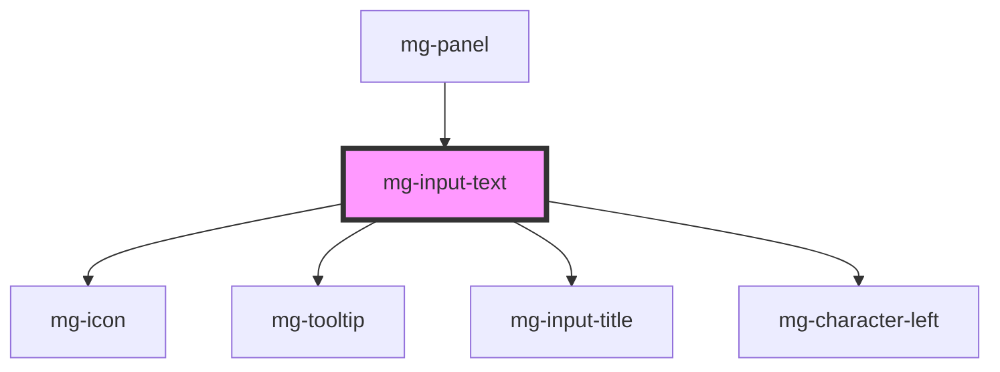

## Design

### Indication du nombre de caractères restants

- lorsque le focus est sur le champ de saisie, un message s'affiche en dessous
- le message est : "<nbCar> caractères disponibles", <nbCar> étant un compteur qui se met à jour dynamiquement en fonction de la saisie
- lorsque le focus n'est plus sur le champ de saisie, le message disparaît

### Valeur

- par défaut limitée 400 caractères de type alpha numérique
- lorsque le champ est utilisé pour saisir une référence, la saisie est limitée à 36 caractères et n'autorise pas les caractères spéciaux

## Use as search input

Due to [accessibility recommendation](https://developer.mozilla.org/fr/docs/Web/HTML/Element/Input/search#les_champs_de_recherche_et_l%E2%80%99accessibilit%C3%A9), an `<input type="search" />` must be used within a `<form role="search" />` we recommend to use mg-input-text as in dedicated story.

## 🚨 Slot

Horizontal spacing is not managed by the component, it must be defined in slot implementation.

<!-- Auto Generated Below -->

## Properties

| Property                | Attribute                 | Description                                                                                                                                    | Type                     | Default                     |
| ----------------------- | ------------------------- | ---------------------------------------------------------------------------------------------------------------------------------------------- | ------------------------ | --------------------------- |
| `characterLeftTemplate` | `character-left-template` | Template to use for characters left sentence                                                                                                   | `string`                 | `undefined`                 |
| `disabled`              | `disabled`                | Define if input is disabled                                                                                                                    | `boolean`                | `false`                     |
| `displayCharacterLeft`  | `display-character-left`  | Define if component should display character left                                                                                              | `boolean`                | `true`                      |
| `helpText`              | `help-text`               | Add a help text under the input, usually expected data format and example                                                                      | `string`                 | `undefined`                 |
| `icon`                  | `icon`                    | Input icon                                                                                                                                     | `string`                 | `undefined`                 |
| `identifier`            | `identifier`              | Identifier is used for the element ID (id is a reserved prop in Stencil.js) If not set, it will be created.                                    | `string`                 | `createID('mg-input-text')` |
| `invalid`               | `invalid`                 | Define input invalid state                                                                                                                     | `boolean`                | `undefined`                 |
| `label` _(required)_    | `label`                   | Input label                                                                                                                                    | `string`                 | `undefined`                 |
| `labelHide`             | `label-hide`              | Define if label is visible                                                                                                                     | `boolean`                | `false`                     |
| `labelOnTop`            | `label-on-top`            | Define if label is displayed on top                                                                                                            | `boolean`                | `undefined`                 |
| `maxlength`             | `maxlength`               | Input max length                                                                                                                               | `number`                 | `400`                       |
| `name`                  | `name`                    | Input name If not set the value equals the identifier                                                                                          | `string`                 | `this.identifier`           |
| `pattern`               | `pattern`                 | Define input pattern to validate                                                                                                               | `string`                 | `undefined`                 |
| `patternErrorMessage`   | `pattern-error-message`   | Define input pattern error message                                                                                                             | `string`                 | `undefined`                 |
| `placeholder`           | `placeholder`             | Input placeholder. It should be a word or short phrase that demonstrates the expected type of data, not a replacement for labels or help text. | `string`                 | `undefined`                 |
| `readonly`              | `readonly`                | Define if input is readonly                                                                                                                    | `boolean`                | `false`                     |
| `required`              | `required`                | Define if input is required                                                                                                                    | `boolean`                | `false`                     |
| `tooltip`               | `tooltip`                 | Add a tooltip message next to the input                                                                                                        | `string`                 | `undefined`                 |
| `type`                  | `type`                    | Input type                                                                                                                                     | `"search" \| "text"`     | `'text'`                    |
| `valid`                 | `valid`                   | Define input valid state                                                                                                                       | `boolean`                | `undefined`                 |
| `value`                 | `value`                   | Component value                                                                                                                                | `string`                 | `undefined`                 |
| `width`                 | `width`                   | Define input width                                                                                                                             | `"full" \| 16 \| 2 \| 4` | `'full'`                    |

## Events

| Event          | Description                         | Type                   |
| -------------- | ----------------------------------- | ---------------------- |
| `input-valid`  | Emited event when checking validity | `CustomEvent<boolean>` |
| `value-change` | Emited event when value change      | `CustomEvent<string>`  |

## Methods

### `displayError() => Promise<void>`

Public method to display errors

#### Returns

Type: `Promise<void>`

### `setFocus() => Promise<void>`

Public method to play input focus

#### Returns

Type: `Promise<void>`

## Dependencies

### Used by

 - [mg-panel](../../mg-panel)

### Depends on

- [mg-icon](../../../atoms/mg-icon)
- [mg-tooltip](../../../atoms/mg-tooltip)
- [mg-input-title](../../../atoms/mg-input-title)
- [mg-character-left](../../../atoms/mg-character-left)

### Graph

----------------------------------------------

*Built with [StencilJS](https://stenciljs.com/)*
