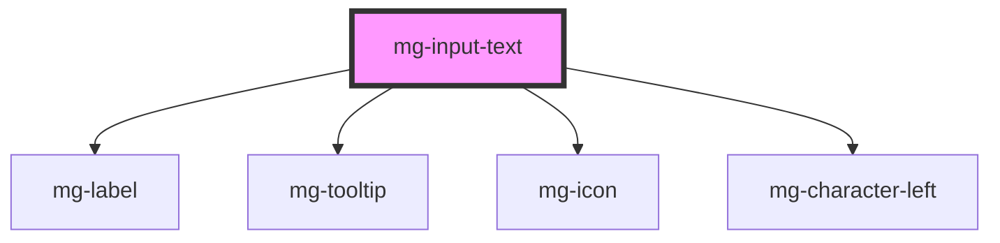

# mg-input-text

<!-- Auto Generated Below -->

## Properties

| Property                | Attribute                 | Description                                                                                                                                    | Type      | Default                     |
| ----------------------- | ------------------------- | ---------------------------------------------------------------------------------------------------------------------------------------------- | --------- | --------------------------- |
| `characterLeftTemplate` | `character-left-template` | Template to use for characters left sentence                                                                                                   | `string`  | `undefined`                 |
| `disabled`              | `disabled`                | Define if input is disabled                                                                                                                    | `boolean` | `false`                     |
| `displayCharacterLeft`  | `display-character-left`  | Define if component should display character left                                                                                              | `boolean` | `true`                      |
| `helpText`              | `help-text`               | Template to use for characters left sentence                                                                                                   | `string`  | `undefined`                 |
| `identifier`            | `identifier`              | Identifier is used for the element ID (id is a reserved prop in Stencil.js) If not set, it will be created.                                    | `string`  | `createID('mg-input-text')` |
| `invalid`               | `invalid`                 | Define input pattern error message                                                                                                             | `boolean` | `undefined`                 |
| `label` _(required)_    | `label`                   | Input label Required                                                                                                                           | `string`  | `undefined`                 |
| `labelColon`            | `label-colon`             | Define if label has colon ":"                                                                                                                  | `boolean` | `false`                     |
| `labelOnTop`            | `label-on-top`            | Define if label is displayed on top                                                                                                            | `boolean` | `undefined`                 |
| `maxlength`             | `maxlength`               | Input max length                                                                                                                               | `number`  | `400`                       |
| `name`                  | `name`                    | Input name If not set the value equals the identifier                                                                                          | `string`  | `this.identifier`           |
| `pattern`               | `pattern`                 | Define input pattern to validate                                                                                                               | `string`  | `undefined`                 |
| `patternErrorMessage`   | `pattern-error-message`   | Define input pattern error message                                                                                                             | `string`  | `undefined`                 |
| `placeholder`           | `placeholder`             | Input placeholder. It should be a word or short phrase that demonstrates the expected type of data, not a replacement for labels or help text. | `string`  | `undefined`                 |
| `readonly`              | `readonly`                | Define if input is readonly                                                                                                                    | `boolean` | `false`                     |
| `required`              | `required`                | Define if input is required                                                                                                                    | `boolean` | `false`                     |
| `tooltip`               | `tooltip`                 | Add a tooltip message next to the input                                                                                                        | `string`  | `undefined`                 |
| `valid`                 | `valid`                   | Define input pattern to validate                                                                                                               | `boolean` | `undefined`                 |
| `value`                 | `value`                   | Component value                                                                                                                                | `string`  | `undefined`                 |

## Events

| Event         | Description                     | Type                  |
| ------------- | ------------------------------- | --------------------- |
| `valueChange` | Emmited event when value change | `CustomEvent<string>` |

## Dependencies

### Depends on

- [mg-label](../../../atoms/mg-label)
- [mg-tooltip](../../../atoms/mg-tooltip)
- [mg-icon](../../../atoms/mg-icon)
- [mg-character-left](../../../atoms/mg-character-left)

### Graph

----------------------------------------------

*Built with [StencilJS](https://stenciljs.com/)*
