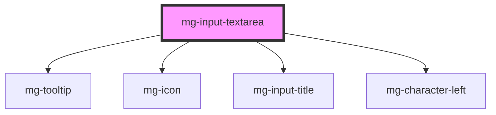

## Design

### Indication of the number of characters left

- when the focus is on the input field, a message is displayed below
- the message is: "<nbCar> characters left", <nbCar> being a counter that updates dynamically according to the input
- when the focus is no longer on the input field, the message disappears

### Value

- by default limited to 4000 alpha numeric characters.

### Dimensions

- the height of the component is by default 3 lines of text (this value is configurable)
- the field can be resized by clicking on the bottom right of the input field

<!-- Auto Generated Below -->

## Properties

| Property                | Attribute                 | Description                                                                                                                                    | Type                                             | Default                         |
| ----------------------- | ------------------------- | ---------------------------------------------------------------------------------------------------------------------------------------------- | ------------------------------------------------ | ------------------------------- |
| `characterLeftTemplate` | `character-left-template` | Template to use for characters left sentence                                                                                                   | `string`                                         | `undefined`                     |
| `disabled`              | `disabled`                | Define if input is disabled                                                                                                                    | `boolean`                                        | `false`                         |
| `displayCharacterLeft`  | `display-character-left`  | Define if component should display character left                                                                                              | `boolean`                                        | `true`                          |
| `helpText`              | `help-text`               | Add a help text under the input, usually expected data format and example                                                                      | `string`                                         | `undefined`                     |
| `identifier`            | `identifier`              | Identifier is used for the element ID (id is a reserved prop in Stencil.js) If not set, it will be created.                                    | `string`                                         | `createID('mg-input-textarea')` |
| `invalid`               | `invalid`                 | Define input invalid state                                                                                                                     | `boolean`                                        | `undefined`                     |
| `label` _(required)_    | `label`                   | Input label                                                                                                                                    | `string`                                         | `undefined`                     |
| `labelHide`             | `label-hide`              | Define if label is visible                                                                                                                     | `boolean`                                        | `false`                         |
| `labelOnTop`            | `label-on-top`            | Define if label is displayed on top                                                                                                            | `boolean`                                        | `undefined`                     |
| `maxlength`             | `maxlength`               | Input max length                                                                                                                               | `number`                                         | `4000`                          |
| `name`                  | `name`                    | Input name If not set the value equals the identifier                                                                                          | `string`                                         | `this.identifier`               |
| `pattern`               | `pattern`                 | Define input pattern to validate                                                                                                               | `string`                                         | `undefined`                     |
| `patternErrorMessage`   | `pattern-error-message`   | Define input pattern error message                                                                                                             | `string`                                         | `undefined`                     |
| `placeholder`           | `placeholder`             | Input placeholder. It should be a word or short phrase that demonstrates the expected type of data, not a replacement for labels or help text. | `string`                                         | `undefined`                     |
| `readonly`              | `readonly`                | Define if input is readonly                                                                                                                    | `boolean`                                        | `false`                         |
| `required`              | `required`                | Define if input is required                                                                                                                    | `boolean`                                        | `false`                         |
| `resizable`             | `resizable`               | Define if input is resizable                                                                                                                   | `"both" \| "horizontal" \| "none" \| "vertical"` | `'none'`                        |
| `rows`                  | `rows`                    | Define the number of visible text lines for the control                                                                                        | `number`                                         | `3`                             |
| `tooltip`               | `tooltip`                 | Add a tooltip message next to the input                                                                                                        | `string`                                         | `undefined`                     |
| `valid`                 | `valid`                   | Define input valid state                                                                                                                       | `boolean`                                        | `undefined`                     |
| `value`                 | `value`                   | Component value                                                                                                                                | `string`                                         | `undefined`                     |
| `width`                 | `width`                   | Define input width                                                                                                                             | `"full" \| 16 \| 2 \| 4`                         | `'full'`                        |

## Events

| Event          | Description                         | Type                   |
| -------------- | ----------------------------------- | ---------------------- |
| `input-valid`  | Emited event when checking validity | `CustomEvent<boolean>` |
| `value-change` | Emited event when value change      | `CustomEvent<string>`  |

## Methods

### `displayError() => Promise<void>`

Public method to display errors

#### Returns

Type: `Promise<void>`

## Dependencies

### Depends on

- [mg-tooltip](../../../atoms/mg-tooltip)
- [mg-icon](../../../atoms/mg-icon)
- [mg-input-title](../../../atoms/mg-input-title)
- [mg-character-left](../../../atoms/mg-character-left)

### Graph

----------------------------------------------

*Built with [StencilJS](https://stenciljs.com/)*
