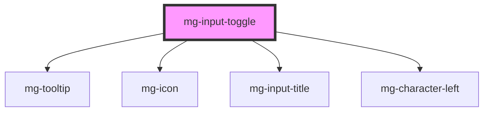

This molecule refers to the [PDA9-770](https://jira.mgdis.fr/browse/PDA9-770).

<!-- Auto Generated Below -->

## Properties

| Property             | Attribute      | Description                                                                                                 | Type                        | Default                       |
| -------------------- | -------------- | ----------------------------------------------------------------------------------------------------------- | --------------------------- | ----------------------------- |
| `disabled`           | `disabled`     | Define if input is disabled                                                                                 | `boolean`                   | `false`                       |
| `helpText`           | `help-text`    | Add a help text under the input, usually expected data format and example                                   | `string`                    | `undefined`                   |
| `identifier`         | `identifier`   | Identifier is used for the element ID (id is a reserved prop in Stencil.js) If not set, it will be created. | `string`                    | `createID('mg-input-toggle')` |
| `isIcon`             | `is-icon`      | Define if toggle display icon                                                                               | `boolean`                   | `false`                       |
| `isOnOff`            | `is-on-off`    | Define if toggle have on/off style                                                                          | `boolean`                   | `false`                       |
| `items` _(required)_ | --             | Items are the possible options to select                                                                    | `ToggleValue[] \| string[]` | `undefined`                   |
| `label` _(required)_ | `label`        | Input label                                                                                                 | `string`                    | `undefined`                   |
| `labelHide`          | `label-hide`   | Define if label is visible                                                                                  | `boolean`                   | `false`                       |
| `labelOnTop`         | `label-on-top` | Define if label is displayed on top                                                                         | `boolean`                   | `undefined`                   |
| `name`               | `name`         | Input name If not set the value equals the identifier                                                       | `string`                    | `this.identifier`             |
| `readonly`           | `readonly`     | Define if input is readonly                                                                                 | `boolean`                   | `false`                       |
| `tooltip`            | `tooltip`      | Add a tooltip message next to the input                                                                     | `string`                    | `undefined`                   |
| `value`              | --             | Component value                                                                                             | `unknown`                   | `undefined`                   |

## Events

| Event          | Description                         | Type                   |
| -------------- | ----------------------------------- | ---------------------- |
| `input-valid`  | Emited event when checking validity | `CustomEvent<boolean>` |
| `value-change` | Emited event when value change      | `CustomEvent<unknown>` |

## Dependencies

### Depends on

- [mg-tooltip](../../../atoms/mg-tooltip)
- [mg-icon](../../../atoms/mg-icon)
- [mg-input-title](../../../atoms/mg-input-title)
- [mg-character-left](../../../atoms/mg-character-left)

### Graph

----------------------------------------------

*Built with [StencilJS](https://stenciljs.com/)*
