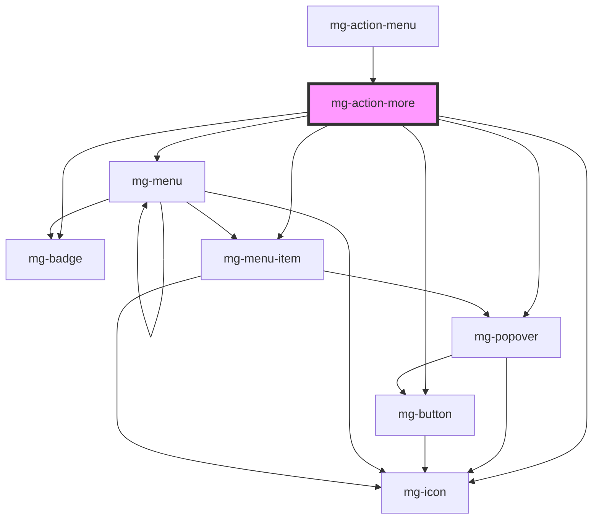

# mg-action-more

<!-- Auto Generated Below -->

## Properties

| Property             | Attribute       | Description                                        | Type         | Default               |
| -------------------- | --------------- | -------------------------------------------------- | ------------ | --------------------- |
| `displayLabel`       | `display-label` | Define if label is display                         | `boolean`    | `undefined`           |
| `icon`               | `icon`          | Define displaied icon Default: 'ellipsis-vertical' | `string`     | `'ellipsis-vertical'` |
| `items` _(required)_ | --              | Define the menu-items elements                     | `ItemType[]` | `undefined`           |

## Events

| Event             | Description                                                 | Type                  |
| ----------------- | ----------------------------------------------------------- | --------------------- |
| `selected-change` | Emitted event when selected item change - item index number | `CustomEvent<number>` |

## Dependencies

### Used by

 - [mg-action-menu](../mg-action-menu)

### Depends on

- [mg-popover](../../mg-popover)
- [mg-button](../../../atoms/mg-button)
- [mg-icon](../../../atoms/mg-icon)
- [mg-badge](../../../atoms/mg-badge)
- [mg-menu](../mg-menu)
- [mg-menu-item](../mg-menu-item)

### Graph

----------------------------------------------

*Built with [StencilJS](https://stenciljs.com/)*
