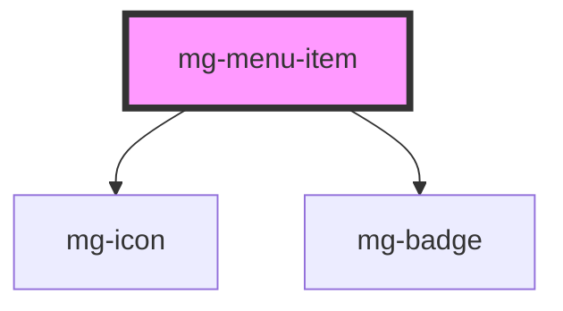

# mg-menu-item

<!-- Auto Generated Below -->

## Properties

| Property             | Attribute    | Description                                                                                                 | Type                                                                                                                                                 | Default               |
| -------------------- | ------------ | ----------------------------------------------------------------------------------------------------------- | ---------------------------------------------------------------------------------------------------------------------------------------------------- | --------------------- |
| `badge`              | --           | Define menu-item badge                                                                                      | `{ value: string \| number; label: string; variant?: "info" \| "primary" \| "secondary" \| "success" \| "warning" \| "danger"; outline?: boolean; }` | `undefined`           |
| `expanded`           | `expanded`   | Define menu-item content expended                                                                           | `boolean`                                                                                                                                            | `false`               |
| `href`               | `href`       | Define menu-item badge when defined menu-item contain an anchor instead of button                           | `string`                                                                                                                                             | `undefined`           |
| `icon`               | --           | Define menu-item icon                                                                                       | `{ icon: string; size?: "small" \| "regular" \| "large" \| "extra-large"; variant?: "info" \| "success" \| "warning" \| "danger"; spin?: boolean; }` | `undefined`           |
| `identifier`         | `identifier` | Identifier is used for the element ID (id is a reserved prop in Stencil.js) If not set, it will be created. | `string`                                                                                                                                             | `createID(this.name)` |
| `label` _(required)_ | `label`      | Define menu-item button label                                                                               | `string`                                                                                                                                             | `undefined`           |
| `menuIndex`          | `menu-index` | Define menu-item index in parent menu                                                                       | `number`                                                                                                                                             | `undefined`           |
| `size`               | `size`       | Define tabs size                                                                                            | `"large" \| "medium" \| "regular"`                                                                                                                   | `'large'`             |
| `status`             | `status`     | Define menu-item status                                                                                     | `Status.ACTIVE \| Status.DISABLED \| Status.HIDDEN \| Status.VISIBLE`                                                                                | `Status.VISIBLE`      |

## Events

| Event          | Description                                                  | Type                  |
| -------------- | ------------------------------------------------------------ | --------------------- |
| `focused-item` | Emited event to communicate next focused menu-item to parent | `CustomEvent<number>` |

## Dependencies

### Depends on

- [mg-icon](../../../atoms/mg-icon)
- [mg-badge](../../../atoms/mg-badge)

### Graph

----------------------------------------------

*Built with [StencilJS](https://stenciljs.com/)*
