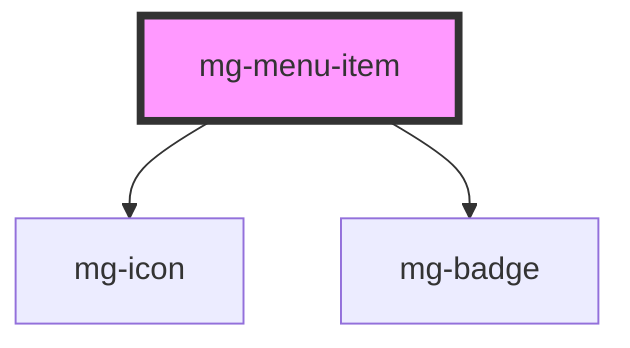

# mg-menu-item

<!-- Auto Generated Below -->

## Properties

| Property             | Attribute     | Description                                                                                                 | Type                                                                  | Default               |
| -------------------- | ------------- | ----------------------------------------------------------------------------------------------------------- | --------------------------------------------------------------------- | --------------------- |
| `badge`              | --            |                                                                                                             | `BadgeType & { variant?: string; }`                                   | `undefined`           |
| `expanded`           | `expanded`    |                                                                                                             | `boolean`                                                             | `false`               |
| `href`               | `href`        |                                                                                                             | `string`                                                              | `undefined`           |
| `icon`               | `icon`        |                                                                                                             | `string`                                                              | `undefined`           |
| `identifier`         | `identifier`  | Identifier is used for the element ID (id is a reserved prop in Stencil.js) If not set, it will be created. | `string`                                                              | `createID(this.name)` |
| `label` _(required)_ | `label`       |                                                                                                             | `string`                                                              | `undefined`           |
| `mgTabindex`         | `mg-tabindex` |                                                                                                             | `number`                                                              | `undefined`           |
| `size`               | `size`        | Define tabs size                                                                                            | `string`                                                              | `'large'`             |
| `status`             | `status`      |                                                                                                             | `Status.ACTIVE \| Status.DISABLED \| Status.HIDDEN \| Status.VISIBLE` | `Status.VISIBLE`      |

## Dependencies

### Depends on

- [mg-icon](../../../atoms/mg-icon)
- [mg-badge](../../../atoms/mg-badge)

### Graph

----------------------------------------------

*Built with [StencilJS](https://stenciljs.com/)*
