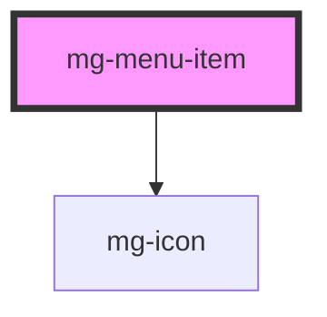

## Use

Item menu is used with horizontal, vertical or mobile menus.

## Anatomy

 

An item has got at least a label.
An icon can be used in addition of the text (before it).
A badge can be added to the end of the item.
When a submenu is available, a chevron is displayed (in horizontal and vertical menus) to indicate its presence.

## Specs

Item's display depends on the size of the menu (regular, medium, large) and its mode (horizontal, vertical, mobile).

### Spacing

 

### Sizing

#### Horizontal menu

 

Width of the item depends on its content.

#### Vertical menu

 

Width of the item is 100% width of the menu.

#### Mobile

 

Width of the item is equal to the width of the menu divided by number of items displayed.

### Alignment

#### Horizontal and vertical menus

 

All contents are aligned vertically.

#### Vertical menu

 

All items are aligned to left.
The chevron is aligned to the right of the item.

#### Mobile

 

Content of the item is centered

 

Badge is positionned to 20px right and -15px up from the center of the item.

### Styling

 

Hover item : the background is colored
Active item : the font color changes, an active bar (3px) is displayed at the bottom of the item for horizontal and mobile menus), at the left of the item for vertical menus.

#### Colors

Standard color is @color-dark.
Active color is the color of the app.
Hover color is the color of the app with an opacity set to 10%.
Disabled item's opacity is set to 30%.

#### Fonts

Family : Open Sans
Regular size : 13px
Medium/Large size : 15px
Mobile : 12px

#### Icons

Regular/Medium/Large menus : regular size
Mobile menu : large size

## Behavior

### Click
Click on an item of the menu can 
 - redirect to an url 
 - display a submenu (see below)

If a submenu is available, an icon "chevron-down" is displayed at the right of the item.
When opened, the chevron makes a 180° rotation.

## Submenu

### Horizontal and vertical menus

Submenu is displayed 
 - by clicking on the item 
 - by pushing the space or enter key

It is closed 
 - by clicking on the item 
 - by pushing the space or enter key
 - by clicking outside of the submenu if the menu is horizontal

The submenu displays :
 - another horizontal or vertical menu with sub items
 - a slot for HTML content

#### In an horizontal menu

Submenu is displayed with a window over the content (like a popover).
The submenu is aligned to the left bottom of the item, excepted for the last item of the menu which is aligned to the right bottom.
If the submenu is higher than the screen size, there is no overflow for the menu, user can scroll the page to see the full submenu. 

 

Submenu has a *@color-white_ background and a _@shadow*.
A top and bottom spacing of 10px.

 

The minimal width of the submenu is the item's width.
Width of the submenu is determined by the width of the largest item or the content of the slot.

#### In a vertical menu

(i) Vertical menu is recommended for the submenu.
Menu is displayed under the item, with the same width. Idem for the slot.
Items below are pushed to bottom.

 

30px added to padding-left

### Mobile menu

 
Submenu is displayed via an **mg-tray** component.

<!-- Auto Generated Below -->

## Properties

| Property                  | Attribute    | Description                                                                       | Type                                                                  | Default          |
| ------------------------- | ------------ | --------------------------------------------------------------------------------- | --------------------------------------------------------------------- | ---------------- |
| `expanded`                | `expanded`   | Define menu-item content expended                                                 | `boolean`                                                             | `false`          |
| `href`                    | `href`       | Define menu-item badge when defined menu-item contain an anchor instead of button | `string`                                                              | `undefined`      |
| `identifier` _(required)_ | `identifier` | Identifier is used for the element ID (id is a reserved prop in Stencil.js)       | `string`                                                              | `undefined`      |
| `label` _(required)_      | `label`      | Define menu-item button label                                                     | `string`                                                              | `undefined`      |
| `menuIndex`               | `menu-index` | Define menu-item index in parent menu                                             | `number`                                                              | `undefined`      |
| `size`                    | `size`       | Define menu-item size                                                             | `"large" \| "medium" \| "regular"`                                    | `'large'`        |
| `status`                  | `status`     | Define menu-item status                                                           | `Status.ACTIVE \| Status.DISABLED \| Status.HIDDEN \| Status.VISIBLE` | `Status.VISIBLE` |

## Events

| Event                | Description                                                  | Type                     |
| -------------------- | ------------------------------------------------------------ | ------------------------ |
| `focused-item`       | Emited event to communicate next focused menu-item to parent | `CustomEvent<number>`    |
| `menu-item-selected` | Emited event when active menu-item change                    | `CustomEvent<undefined>` |

## Dependencies

### Depends on

- [mg-icon](../../../atoms/mg-icon)

### Graph

----------------------------------------------

*Built with [StencilJS](https://stenciljs.com/)*
