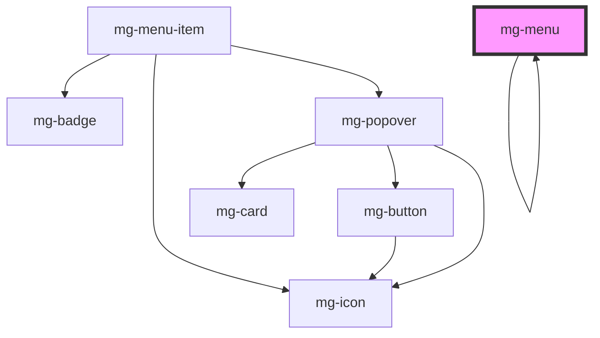

## Horizontal

### Use

Horizontal menu is used with large ("desktop") resolutions, it is placed in the upper area of the screen.

### Anatomy

 

 

### Options

#### Meta

Meta text is optional.

#### Icon

Icon is optional.
Use it on all or none of the menu items.

#### Illustration

Illustration is optional.
An SVG can be specified instead of an icon.

#### Badge

Badge is optional.
Use it when you need to notify new events in this section.

### Behavior

#### Sizing

 

A horizontal menu can display different item sizes: regular, medium, large.

 

Le contenu de l'item détermine sa largeur, mais pour gérer le cas où le contenu peut être trop grand (libellé long), il est possible de spécifier une largeur maximale à l'item.
*Libellé_ et _Meta* sont alors tronqués.

#### Sub-content

 

A "submenu" or a "free content" can be set to the item.
An icon "chevron-down" at the right of the item informs the user.

##### Badge

 

If at least one sub item has got a badge, the item displays a badge with exclamation symbol.

#### Overflow

 

When not all of the items can be displayed because of the width of the menu's container, items are grouped in a "plus item".

## Vertical

### Use

 

Horizontal menu is used with large ("desktop") resolutions, it is mostly placed in the left area of the screen.

### Anatomy

 

 

### Options

#### Icon

Icon is optional.

Use it on all of one level or none of the items of the menu.

#### Badge

Badge is optional.

Use it when you need to notify new events in this section.

### Behavior

#### Sub content

An item can display a sub content which can be another vertical menu.
This item displays a chevron at its right.
The submenu is displayed by clicking on the item.

##### Badge

 

If at least one sub item has got a badge, the item displays a badge with exclamation symbol.

#### Overflow

 

When not all of the items can be displayed because of the height of the menu's container, a scrollbar allows to see hidden items.

## CSS Variables

### global

- `--mg-menu-background-color-hsl`: define mg-menu background color. Default: `--color-light`.

<!-- Auto Generated Below -->

## Properties

| Property             | Attribute   | Description                                                                         | Type                                                                                                                           | Default                |
| -------------------- | ----------- | ----------------------------------------------------------------------------------- | ------------------------------------------------------------------------------------------------------------------------------ | ---------------------- |
| `direction`          | `direction` | Component display direction. Default: "horizontal"                                  | `Direction.HORIZONTAL \| Direction.VERTICAL`                                                                                   | `Direction.HORIZONTAL` |
| `label` _(required)_ | `label`     | Menu label. Include short menu description. Required for accessibility              | `string`                                                                                                                       | `undefined`            |
| `moreitem`           | --          | Customize mg-menu "more element" Used with direction: 'vertical' to manage overflow | `{ mgIcon?: { icon: string; }; slotLabel?: { label?: string; display?: boolean; }; size?: "regular" \| "large" \| "medium"; }` | `undefined`            |
| `size`               | `size`      | Define mg-menu size Default: 'regular'                                              | `"large" \| "medium" \| "regular"`                                                                                             | `'regular'`            |

## Dependencies

### Used by

 - [mg-menu](.)

### Depends on

- [mg-menu-item](../mg-menu-item)
- [mg-icon](../../../atoms/mg-icon)
- [mg-menu](.)

### Graph

----------------------------------------------

*Built with [StencilJS](https://stenciljs.com/)*
