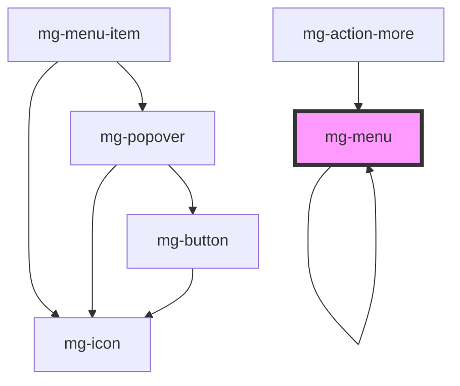

## Horizontal

### Use

Horizontal menu is used with large ("desktop") resolutions, it is placed in the upper area of the screen.

### Anatomy

A menu is composed of [**mg-menu-items**](./?path=/docs/molecules-menus-mg-menu-item--mg-menu-item).

### Behavior

#### TODO / Too large

When not all of the items can be displayed because of the width of the menu's container, items are grouped in a "plus" item **(TODO)**.

### Specs

#### Sizing

An horizontal menu can display different sizes of items (see definition of **[mg-menu-item](./?path=/docs/molecules-menus-mg-menu-item--mg-menu-item)**) : regular, medium, large.

#### Spacing

Space between items is 0.

### Vertical

### Use

Horizontal menu is used with large ("desktop") resolutions, it is placed in the left area of the screen.

 

### Anatomy

A menu is composed of **[mg-menu-item](./?path=/docs/molecules-menus-mg-menu-item--mg-menu-item)**.

### Behavior

#### Too high

 

When not all of the items can be displayed because of the height of the menu's container, a scrollbar allows to see hidden items.

### Specs

#### Sizing

The width of the menu depend on his container.

#### Spacing

 

Space between items is 0.

#### Colors

Default background color is @color-light.

## CSS Variables

### global

- `--mg-menu-background-color-hsl`: define mg-menu background color. Default: `--color-light`.

<!-- Auto Generated Below -->

## Properties

| Property             | Attribute         | Description                                                            | Type                                         | Default                |
| -------------------- | ----------------- | ---------------------------------------------------------------------- | -------------------------------------------- | ---------------------- |
| `activeOverflow`     | `active-overflow` | Define component manage child overflow                                 | `boolean`                                    | `undefined`            |
| `direction`          | `direction`       | Component display direction. Default: "horizontal"                     | `Direction.HORIZONTAL \| Direction.VERTICAL` | `Direction.HORIZONTAL` |
| `label` _(required)_ | `label`           | Menu label. Include short menu description. Required for accessibility | `string`                                     | `undefined`            |

## Dependencies

### Used by

 - [mg-action-more](../mg-action-more)
 - [mg-menu](.)

### Depends on

- [mg-menu-item](../mg-menu-item)
- [mg-icon](../../../atoms/mg-icon)
- [mg-badge](../../../atoms/mg-badge)
- [mg-menu](.)

### Graph

----------------------------------------------

*Built with [StencilJS](https://stenciljs.com/)*
