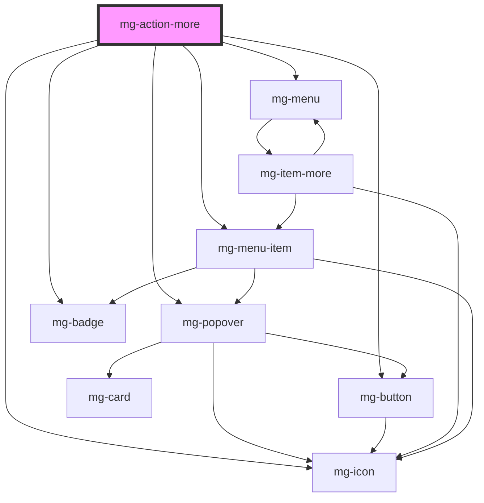

## Anatomy

 

## Specifications

 

### Spacing
Popover padding should be 10px up/down, 0px left/right.

## Behavior

### Action

In addition of the standard popover's behavior, when an item of the menu is clicked the popover closes itself.

## Options

### Button's variant

 

By default, button variant is "flat".
It is possible to set another variant (see [mg-button](http://core.pages.mgdis.fr/core-ui/mg-components/?path=/story/atoms-mg-button--mg-button)).

### Icon

By default, icon is *ellipsis*. 
It is possible to set another icon

### Label

 

By default, label is *Actions* and hidden. 
It is possible to set another label.

### Chevron

 

It is possible to display a chevron on the label right side, it make a 180 degree rotation on click.

<!-- Auto Generated Below -->

## Properties

| Property             | Attribute         | Description                                                        | Type                                                                                                                                             | Default                             |
| -------------------- | ----------------- | ------------------------------------------------------------------ | ------------------------------------------------------------------------------------------------------------------------------------------------ | ----------------------------------- |
| `button`             | --                | Define button properties Default: {variant: 'flat', isIcon: true}. | `{ isIcon: boolean; variant: "flat" \| "info" \| "success" \| "link" \| "primary" \| "secondary" \| "danger" \| "danger-alt"; label?: string; }` | `{ variant: 'flat', isIcon: true }` |
| `displayChevron`     | `display-chevron` | Define if chevron is display                                       | `boolean`                                                                                                                                        | `undefined`                         |
| `icon`               | --                | Define displaied icon Default: {icon: 'ellipsis'}                  | `{ icon: string; }`                                                                                                                              | `{ icon: 'ellipsis' }`              |
| `items` _(required)_ | --                | Define the menu-items elements                                     | `MgActionMoreItemType[]`                                                                                                                         | `undefined`                         |

## Dependencies

### Depends on

- [mg-icon](../../atoms/mg-icon)
- [mg-popover](../mg-popover)
- [mg-button](../../atoms/mg-button)
- [mg-menu](../menu/mg-menu)
- [mg-menu-item](../menu/mg-menu-item)
- [mg-badge](../../atoms/mg-badge)

### Graph

----------------------------------------------

*Built with [StencilJS](https://stenciljs.com/)*
