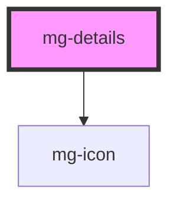

## Properties
 

- **summary** and **details** are slots which allow html content
- **toggle** is defined by mg-icon plus a custom text
  - mg-icon _chevron-down_ is used for the close state
  - mg-icon _chevron-up_ is used for the open state

## Behavior

### Action

The complete zone including the _summary_ and the _toggle_ is clickable and toggles the state of the component.
 

### Position

_Toggle_ follows the _summary_ and is always on the top right.
 

### Responsive

In mobile resolution, the text of the _toggle_ is hidden
 

## Specs

### Spacing
 

<!-- Auto Generated Below -->

## Properties

| Property                    | Attribute       | Description                             | Type      | Default     |
| --------------------------- | --------------- | --------------------------------------- | --------- | ----------- |
| `expanded`                  | `expanded`      | Define if details are diplayed          | `boolean` | `false`     |
| `hideSummary`               | `hide-summary`  | Hide summary element                    | `boolean` | `false`     |
| `toggleClosed` _(required)_ | `toggle-closed` | Displayed title when details are closed | `string`  | `undefined` |
| `toggleOpened` _(required)_ | `toggle-opened` | Displayed title when details are opened | `string`  | `undefined` |

## Events

| Event             | Description                        | Type                   |
| ----------------- | ---------------------------------- | ---------------------- |
| `expanded-change` | Emmited event when expanded change | `CustomEvent<boolean>` |

## Dependencies

### Depends on

- [mg-icon](../../atoms/mg-icon)

### Graph

----------------------------------------------

*Built with [StencilJS](https://stenciljs.com/)*
