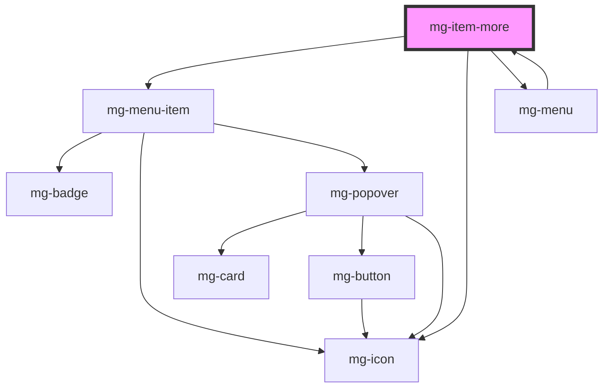

# mg-item-more

<!-- Auto Generated Below -->

## Properties

| Property    | Attribute | Description                                         | Type                                     | Default                         |
| ----------- | --------- | --------------------------------------------------- | ---------------------------------------- | ------------------------------- |
| `icon`      | --        | Define icon Default: {icon: 'ellipsis-vertical'}    | `{ icon: string; }`                      | `{ icon: 'ellipsis-vertical' }` |
| `size`      | `size`    | Define component child menu size.                   | `"large" \| "medium" \| "regular"`       | `undefined`                     |
| `slotlabel` | --        | Define slot label element Default: {display: false} | `{ label?: string; display?: boolean; }` | `{ display: false }`            |

## Dependencies

### Used by

 - [mg-menu](../menu/mg-menu)

### Depends on

- [mg-menu-item](../menu/mg-menu-item)
- [mg-icon](../../atoms/mg-icon)
- [mg-menu](../menu/mg-menu)

### Graph

----------------------------------------------

*Built with [StencilJS](https://stenciljs.com/)*
