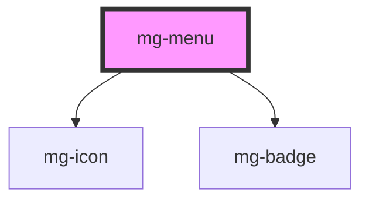

## Anatomy

## Specs

### Spacing

- Standard : @base = 10px
- Large : @base = 18px

- if only text, no extra spacing,
- if no badge : no extra spacing on the right
- if only icon : no extra spacing on the right

### Sizing

### States

### Responsive

#### Line breaks (current management)

<!-- Auto Generated Below -->

## Properties

| Property             | Attribute     | Description                                                                                                 | Type                    | Default               |
| -------------------- | ------------- | ----------------------------------------------------------------------------------------------------------- | ----------------------- | --------------------- |
| `activeItem`         | `active-item` | Active tab number default: first is 1                                                                       | `number`                | `1`                   |
| `identifier`         | `identifier`  | Identifier is used for the element ID (id is a reserved prop in Stencil.js) If not set, it will be created. | `string`                | `createID('mg-menu')` |
| `items` _(required)_ | --            | Nav items Required                                                                                          | `NavItem[] \| string[]` | `undefined`           |
| `label` _(required)_ | `label`       | Nav label. Include short nav description. Required for accessibility                                        | `string`                | `undefined`           |

## Events

| Event                | Description                              | Type                  |
| -------------------- | ---------------------------------------- | --------------------- |
| `active-item-change` | Emited event when active nav item change | `CustomEvent<number>` |

## Dependencies

### Depends on

- [mg-icon](../../atoms/mg-icon)
- [mg-badge](../../atoms/mg-badge)

### Graph

----------------------------------------------

*Built with [StencilJS](https://stenciljs.com/)*
