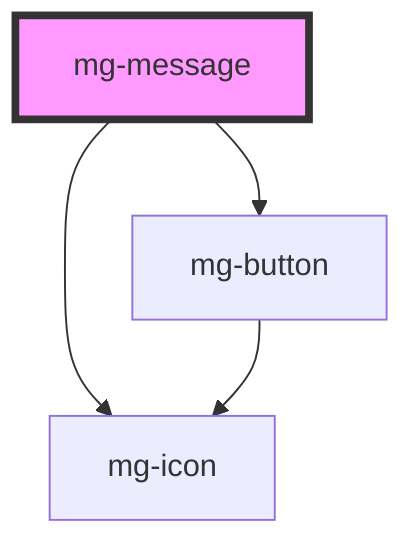

## Design

**RG-01** : L'élément peut être fermé unitairement (à l'aide d'un croix dans sa partie supérieure droite).

**RG-02** : L'élément peut afficher une ou des informations (texte, lien, images, ...)

**RG-03** : L'élément peut être de 4 types différents selon le message à indiquer:
- validation (vert)
- information (bleu)
- avertissement (orange)
- erreur (rouge)

**RG-04** : Lors de la mise en place d'un déclencheur (bouton...) qui peut provoquer l'affichage de messages. Par défaut, l'exécution du déclencheur efface les messages précédents dans l'écran du même type

### Standard

### Actions

### Fermer

### Formes et couleurs

### Tailles

### Espacements

#### Standard

#### Actions

#### Fermer

### Polices

<!-- Auto Generated Below -->

## Properties

| Property      | Attribute      | Description                                                                                                                   | Type      | Default                  |
| ------------- | -------------- | ----------------------------------------------------------------------------------------------------------------------------- | --------- | ------------------------ |
| `closeButton` | `close-button` | Define if message has a cross button RG 01: https://jira.mgdis.fr/browse/PDA9-140                                             | `boolean` | `false`                  |
| `delay`       | `delay`        | Add a delay to hide/close message when it passed Value is defined in seconds and must greater than 2 seconds (PDA9-314 RG-06) | `number`  | `undefined`              |
| `hide`        | `hide`         | Define if message is hidden                                                                                                   | `boolean` | `false`                  |
| `identifier`  | `identifier`   | Identifier is used for the element ID (id is a reserved prop in Stencil.js) If not set, it will be created.                   | `string`  | `createID('mg-message')` |
| `variant`     | `variant`      | Message variant                                                                                                               | `string`  | `variants[0]`            |

## Events

| Event            | Description                           | Type                  |
| ---------------- | ------------------------------------- | --------------------- |
| `component-hide` | Emited event when message is hidden   | `CustomEvent<string>` |
| `component-show` | Emited event when message is diplayed | `CustomEvent<string>` |

## Dependencies

### Depends on

- [mg-icon](../../atoms/mg-icon)
- [mg-button](../../atoms/mg-button)

### Graph

----------------------------------------------

*Built with [StencilJS](https://stenciljs.com/)*
